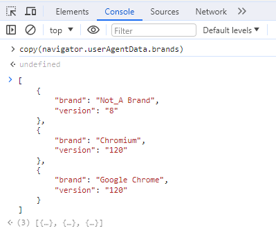

# {Developer Tools} Console tab utility function
The Console tab in developer tools provides useful utility functions for debugging.

Today we will learn about Console tab utility functions that we will use someday.

index
- clear(): When you want to remove all console logs
- copy(param): When you want to copy
- $_: When you want to refer to the previous execution result
- $(selector), $$(selector): When you want to refer to the DOM

## clear(): When you want to remove all console logs

The clear() function removes all logs currently displayed in the console panel. This is useful when you want to remove all logs and start working on something new.

After executing clear(), you will see something like Console was cleared.

## copy(param): When you want to copy

copy(param) copies the content in param. This is useful when you want to copy the JavaScript execution results. It is also used to create mock-up data to be used in test cases.

## $_: When you want to refer to the previous execution result

$_ is used when you want to refer to the previous execution result.

When debugging an array, you can run the array first and reference it with $_.

## $(selector), $$(selector): When you want to refer to the DOM

$(selector), $$(selector) are used when you want to refer to the DOM. $(selector) is similar to document.querySelector, and $$(selector) is similar to document.querySelectorAll.

So far, we have looked at the Console tab utility functions.

There are various other functions in addition to the utility functions introduced here, so if you are curious, please refer to the links below.

[https://learn.microsoft.com/en-us/microsoft-edge/devtools-guide-chromium/console/utilities](https://learn.microsoft.com/en-us/microsoft-edge/devtools-guide-chromium/console/utilities)

thank you