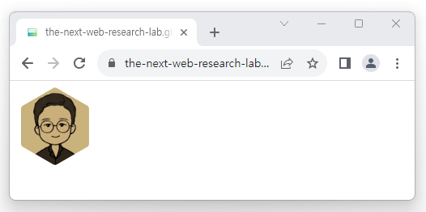

# Making a hexagonal profile with SVG and CSS Mask
I used to work on a web3-related community service at my previous job. When users set their profile image as NFT, they had to display it as a hexagon, and at first I used SVG, which can handle shapes freely. However, there was an issue that SVG was displayed as a square box when the web viewer's processing increased on iPhone, so I solved it by using CSS Mask feature.

In this article, I will introduce how to make a hexagonal profile using SVG and CSS Mask. You can also use these features to make different shapes.

## Making a hexagonal profile with SVG

::: normal-demo SVG ClipPath

```html
<svg 
  xmlns="http://www.w3.org/2000/svg" 
  width="2.25rem"
  height="2.25rem"
  viewBox="0 0 36 36">
  <clipPath id="hexagon-clip-path">
   <use href="#hexagon-path"/>
  </clipPath>
  <path 
   id="hexagon-path"
    style="fill: #000"
    d="M15.5 0.65470053837926a4 4 0 0 1 4 0l11.58845726812 6.6905989232415a4 4 0 0 1 2 3.4641016151378l0 13.381197846483a4 4 0 0 1 -2 3.4641016151378l-11.58845726812 6.6905989232415a4 4 0 0 1 -4 0l-11.58845726812 -6.6905989232415a4 4 0 0 1 -2 -3.4641016151378l0 -13.381197846483a4 4 0 0 1 2 -3.4641016151378"
  />
  <image
   clip-path="url(#hexagon-clip-path)"
    width="100%"
    height="100%"
    href="https://user-images.githubusercontent.com/17817719/258330341-480ae4d2-8071-4bf7-b8b6-7cac9b86c1a1.jpg"
  ></image>
</svg>
```

:::

### 1. Make a hexagonal shape with path tag
Create a basic svg tag and make a hexagonal shape path inside the svg tag.
```svg
<svg 
  xmlns="http://www.w3.org/2000/svg" 
  width="2.25rem"
  height="2.25rem"
  viewBox="0 0 36 36">
  <path 
    style="fill: #000"
    d="M15.5 0.65470053837926a4 4 0 0 1 4 0l11.58845726812 6.6905989232415a4 4 0 0 1 2 3.4641016151378l0 13.381197846483a4 4 0 0 1 -2 3.4641016151378l-11.58845726812 6.6905989232415a4 4 0 0 1 -4 0l-11.58845726812 -6.6905989232415a4 4 0 0 1 -2 -3.4641016151378l0 -13.381197846483a4 4 0 0 1 2 -3.4641016151378"
  />
</svg>
```

### 2. Use image tag for profile image
```svg{10-14}
<svg 
  xmlns="http://www.w3.org/2000/svg" 
  width="2.25rem"
  height="2.25rem"
  viewBox="0 0 36 36">
  <path 
    style="fill: #000"
    d="M15.5 0.65470053837926a4 4 0 0 1 4 0l11.58845726812 6.6905989232415a4 4 0 0 1 2 3.4641016151378l0 13.381197846483a4 4 0 0 1 -2 3.4641016151378l-11.58845726812 6.6905989232415a4 4 0 0 1 -4 0l-11.58845726812 -6.6905989232415a4 4 0 0 1 -2 -3.4641016151378l0 -13.381197846483a4 4 0 0 1 2 -3.4641016151378"
  />
  <image
    width="100%"
    height="100%"
    href="https://user-images.githubusercontent.com/17817719/258330341-480ae4d2-8071-4bf7-b8b6-7cac9b86c1a1.jpg"
  ></image>
</svg>
```

### 3. Cut out the outside area of the path with clipPath
```svg{6-8,10,15}
<svg 
  xmlns="http://www.w3.org/2000/svg" 
  width="2.25rem"
  height="2.25rem"
  viewBox="0 0 36 36">
  <clipPath id="hexagon-clip-path">
    <use href="#hexagon-path"/>
  </clipPath>
  <path 
    id="hexagon-path"
    style="fill: #000"
    d="M15.5 0.65470053837926a4 4 0 0 1 4 0l11.58845726812 6.6905989232415a4 4 0 0 1 2 3.4641016151378l0 13.381197846483a4 4 0 0 1 -2 3.4641016151378l-11.58845726812 6.6905989232415a4 4 0 0 1 -4 0l-11.58845726812 -6.6905989232415a4 4 0 0 1 -2 -3.4641016151378l0 -13.381197846483a4 4 0 0 1 2 -3.4641016151378"
  />
  <image
    clip-path="url(#hexagon-clip-path)"
    width="100%"
    height="100%"
    href="https://user-images.githubusercontent.com/17817719/258330341-480ae4d2-8071-4bf7-b8b6-7cac9b86c1a1.jpg"
  ></image>
</svg>
```

## Making a hexagonal profile with CSS Mask

[See demo](https://the-next-web-research-lab.github.io/docs/essay/demo/hexagon-profile/css-mask.html)



### 1. Load the profile image with img tag and set the size
```html{4-9,12-18}
<!DOCTYPE html>
<html>
<head>
  <style>
    .profile {
      width: 6rem;
      height: 6rem;
    }
  </style>
</head>
<body>
  <div class="profile">
    
  </div>
</body>
</html>
```

### 2. Mask with hexagonal image
Use images from the same domain because images loaded with CSS are affected by CORS.

```html{9-12,14-17}
<!DOCTYPE html>
<html>
<head>
  <style>
    .profile {
      width: 6rem;
      height: 6rem;
      
      mask-image: url('./hexagon.png');
      mask-repeat: no-repeat;
      mask-size: contain;
      mask-position: center center;
      
      -webkit-mask-image: url('./hexagon.png');
      -webkit-mask-repeat: no-repeat;
      -webkit-mask-size: contain;
      -webkit-mask-position: center center;
    }
  </style>
</head>
<body>
  <div class="profile">
    
  </div>
</body>
</html>
```