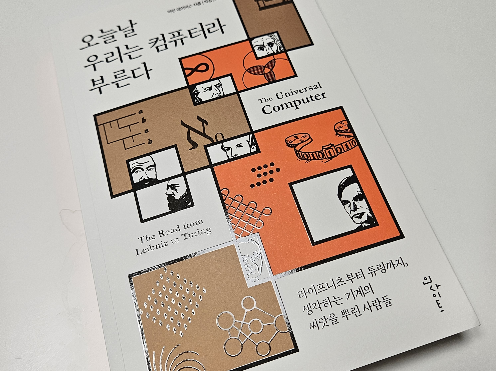

# Today We Call It Computer
> This review was written with the support of Insight Publishing before the publication of the book.

## Source
『Today We Call It Computer』| Martin Davis / Park Sang-min (trans.) | Insight | August 25, 2023

## One-line review
A book that details the historical and logical and mathematical discoveries of the people who lived in their times

## Summary
This book tells the stories of the people who discovered the ideas that form the basis of modern computers. It goes back 300 years to look at the lives and achievements of Leibniz, Boole, Frege, Cantor, Hilbert, Gödel, and Turing.

It also covers von Neumann and Turing, who laid the foundation for the universal computer. Von Neumann contributed to the ENIAC, which consisted of 18,000 vacuum tubes, and pursued a classical method of mathematical calculation that repeated complex calculations countless times. On the other hand, Turing contributed to the Colossus, which consisted of 1,500 vacuum tubes, and proposed a relatively simple machine, and left the rest of the functionality to be solved by software.