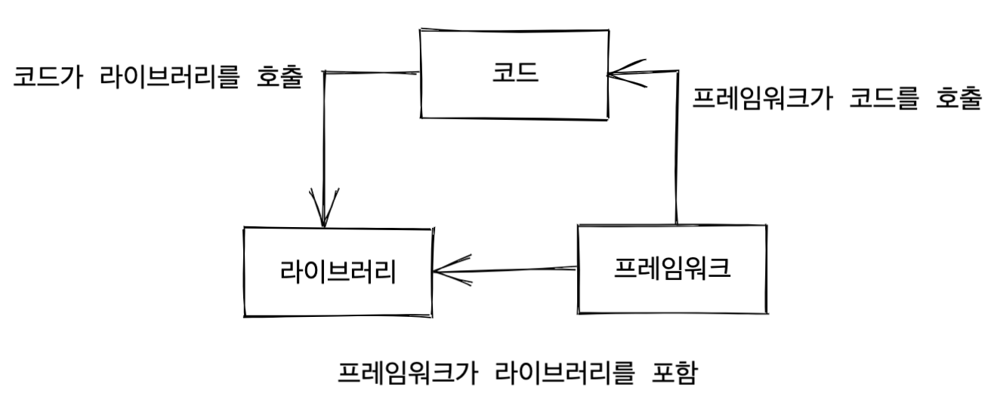

# Book Review Series - Front-end development without frameworks
## Source
Francesco Strazzullo. 『Front-end development without frameworks』. Ryu Youngsun (trans.). Acon Publishing, 2021.

## One-line review
It's a good way to understand the frameworks we use by following the method of making frameworks ourselves.

## Frameworkless movement
This book covers two topics: **how to work effectively without frameworks** and **how to choose the right framework for your project**. The manifesto of this movement is posted on the [official website](https://www.frameworklessmovement.org/).

One of the main interests is to help people understand that **working without frameworks is truly possible** and to make an effort to help them understand the importance of technical decision-making.

It does not claim that only the frameworkless option is right. Depending on the situation, it acknowledges that choosing the right framework can greatly help reduce development time and
succeed in the project.
It also explains how to choose the 'appropriate' framework according to systematic analysis and decision-making techniques.

## About frameworks
### What is a framework?
The relationship between code, framework, and library

### Technical debt
Ward Cunningham introduced the concept of technical debt. Technical debt means that the cost of changing existing features or adding new features increases exponentially over time.

### Framework cost and technical investment
Frameworks already include costs in the architecture itself. But a framework chosen for a valid reason is an asset, not a cost.
