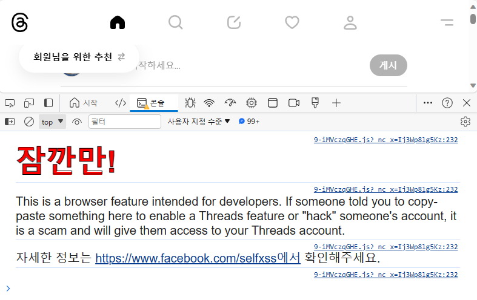
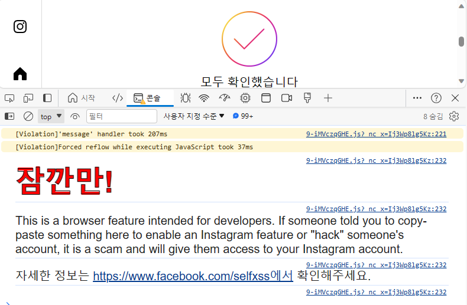
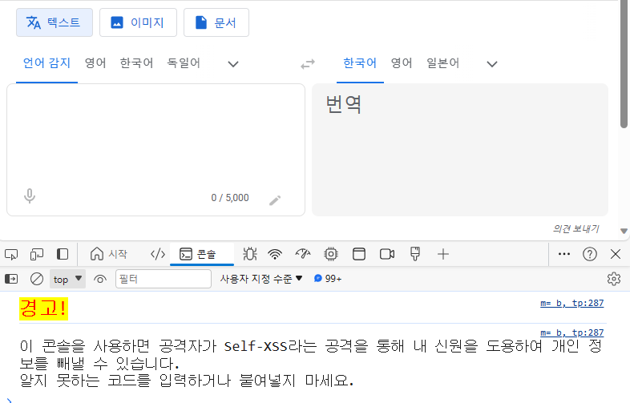
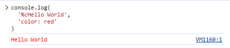
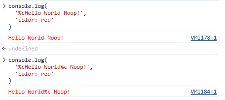
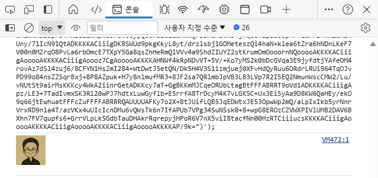

# How to use CSS in console.log

For debugging, various methods such as log, info, error, dir, table, etc. of the console object are used.

You can use CSS in addition to text and objects. Today we will learn how to use CSS in console.log!

## Use Case: Beware of Self-XSS
If you look for use cases in popular services, you will be warned about Self-XSS.

Instagram, Threads, and Facebook operated by Meta provide warnings about Self-XSS as follows.





Google Translator warns:



(We'll talk about Self-XSS next!)

## How to use CSS
You can apply CSS styles using %c. (Open the developer tools and give it a try!)

```js
console.log(
  '%cHello World',
  'color: red'
)
```


After applying CSS, it will not be deactivated even if a new %c is encountered or a space is used, so use an empty character to deactivate CSS application.

```js
console.log(
  '%cHello World%c Noop!',
  'color: red',
  '' // deactivate CSS
)
```





## Supported CSS ranges
The CSS available in console.log is limited. You can use CSS as shown below, and SVG and images can be used by using the background.

- background / color / font
- border / border-radius / margin / outline / padding
- box-shadow / box-decoration-break
- display / clear / float
- cursor / writing-mode
- line-height / text-*
- white-space / word-spacing / word-break



This is how to use CSS in console.log. thank you