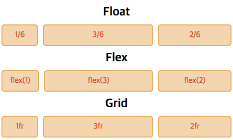

# CSS Layout Comparison - Float vs Flex vs Grid
There are various ways to code a layout. The methods of arranging the layout have evolved in the order of Float, Flex, and Grid. This article summarizes the differences between these technologies and the advantages of using Grid, which was most recently developed.

## Implementing the Grid System
Let’s compare the code when dividing the 6 Grid into 1:3:2 and each having the same margin.



### Float
When developing with Float, you had to calculate the horizontal size directly and write it, and you had to code using special methods like `overflow: hidden`.

```html
<div class="box">
  <div class="item">1/6</div>
  <div class="item">3/6</div>
  <div class="item">2/6</div>
</div>
```
```css
.box {overflow: hidden}
.item {float: left}
.item:nth-of-type(1) {
  width: calc((100% - 20px) * 1 / 6)
}
.item:nth-of-type(2) {
  width: calc((100% - 20px) * 3 / 6);
  margin: 0 10px
}
.item:nth-of-type(3) {
  width: calc((100% - 20px) * 2 / 6)
}
```

### Flex
With the introduction of Flex, it became possible to write more abstractly. If you enter a 1:3:2 ratio in the child element, you can specify the layout.

```html
<div class="box">
  <div class="item">flex(1)</div>
  <div class="item">flex(3)</div>
  <div class="item">flex(2)</div>
</div>
```
```css
.box {display: flex;}
.item:nth-of-type(1) {flex: 1}
.item:nth-of-type(2) {
  flex: 3;
  margin: 0 10px
}
.item:nth-of-type(3) {flex: 2}
```

### Grid
Grid allows you to write ratios abstractly like Flex, and unlike Flex, you can write from the parent side. Since the layout of the children can be manipulated from the parent, layout coding can be modified in one part.

```html
<div class="box">
  <div>1fr</div>
  <div>3fr</div>
  <div>2fr</div>
</div>
```
```css
.box {
  display: grid;
  grid-template-columns: 1fr 3fr 2fr;
  grid-gap: 10px
}
```

