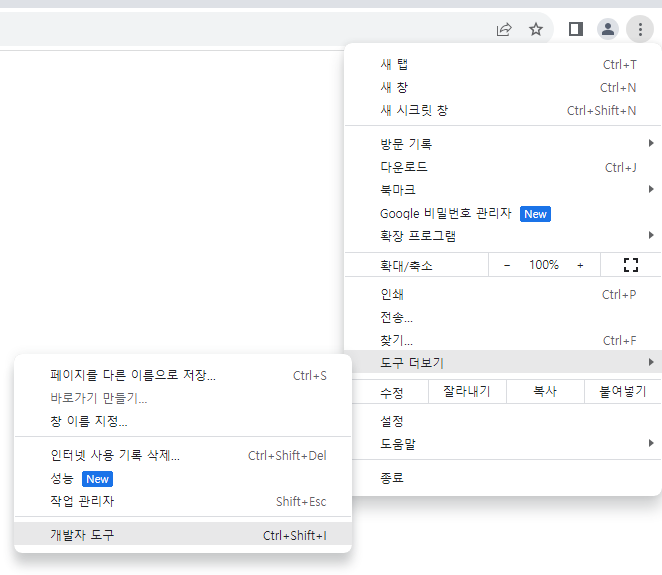
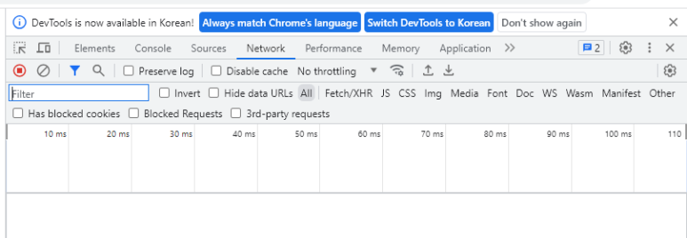

# Understanding the Network Tab in Chrome Developer Tools
## Open the Network Tab
The Network tab is in the Chrome Developer Tools. You can open it with the Ctrl + Shift + i shortcut key or through the menu.

## Network Tab
In the Network tab, you can check the resources of the web site, such as images, videos, HTML, CSS, JS, etc. Generally, you check whether the resources are downloaded normally or optimize them by checking the size and download time of the resources.

- Disable cache: Check whether to use HTTP Cache or not.
- No throttling: Adjust the network speed and use it when testing in a slow network environment.
- Fetch/XHR: You can check HTTP Request/Response through JS.
- WS: You can check WebSocket.

## Network speed control related terms

The network-related terms used in Chrome Developer Tools are as follows.

- Network tab > Throttling
  - Download / Upload / Latency
- Lighthouse tab
  - 40 ms TCP RTT / 10,240 Kbps throughput (Simulated)

### Term definition
The meanings of the terms used here are as follows.

#### Download / Upload
- It means the speed of downloading and uploading resources.

#### Latency (waiting time)
- It means the time it takes between the time the data is requested and the time the data arrives.

#### RTT
- It is an acronym for Round Trip Time and means round-trip time.
- It means the time it takes for a packet to be transmitted from the network start point to the target and the time it takes for the approval of the packet to be transmitted back to the network start point.

#### Throughput (processing amount)
- It means the amount of data that can be transmitted per second.