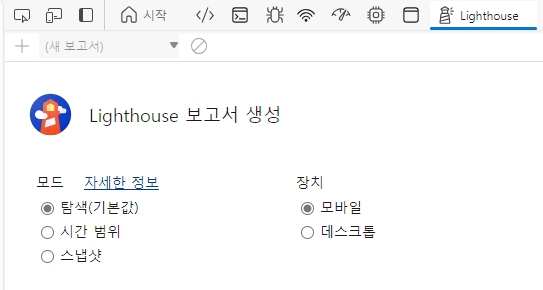
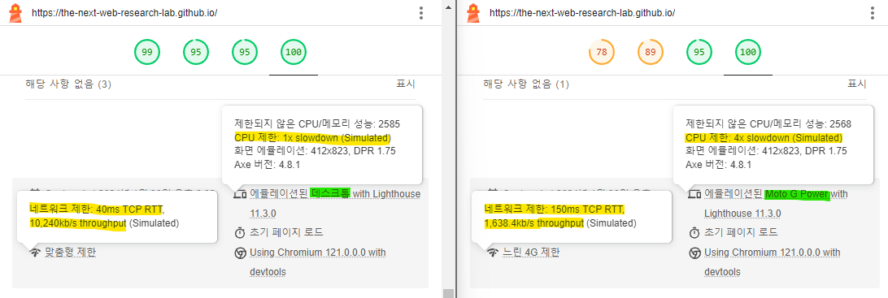

# {Lighthouse Deep Dive} Understanding Mobile Devices (Why the measurements in the ft. Performance tab are different)
I mainly use Lighthouse to measure the performance of web pages. Lighthouse is an open source web page quality improvement tool released by Google Chrome, and can be easily used in Chrome Developer Tools.

Lighthouse allows you to select your mobile device. Did you know that when you select a mobile device and measure its performance, not only the screen size but also CPU and network performance are adjusted?

This time, we will learn about understanding mobile devices in Lighthouse by comparing them to desktops in Lighthouse.

index
- 1. Device screen
- 2. Device performance
- Appendix) Reasons for differences from the measurement results in the Performance tab

## 1. Device screen

Lighthouse displays mobile and desktop screens differently.

The mobile screen is displayed by adjusting device emulation. So no matter how much you adjust the browser size, the mobile screen does not change and always displays the same screen.

The desktop screen is displayed based on the screen currently being displayed. So, when you adjust the browser size, the desktop screen also changes.

## 2. Device performance

Lighthouse sets CPU and network performance differently for mobile and desktop.

In the case of mobile, the CPU is reduced by 4 times, network latency is increased, and network communication speed is slowed down. To be exact, the delay time is set to a fixed value of 150ms, the download speed is 1.6Mbps, and the upload speed is 750Kbps.

The desktop uses the performance of the PC being measured. Therefore, the higher the performance of the computer, the better the performance of the web page.

## Appendix) Reasons for differences from the measurement results in the Performance tab
Lighthouse's mobile devices measure performance after degrading CPU and network, so the measurements in the Performance tab may differ.

By adjusting CPU and network performance in the Performance tab, you can obtain results similar to those measured in Lighthouse.

### CPU Performance Control

When you click the gear in the Performance tab, the performance adjustment panel is exposed, and the CPU can be adjusted directly with the selection box.

### Network Performance Control

Click the Add button to set the network to the same performance as Lighthouse's mobile performance and then use it.

This is all about understanding Lighthouse mobile devices. thank you