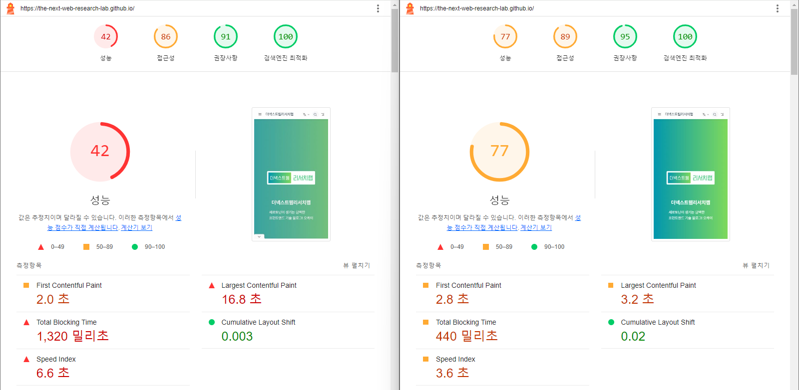
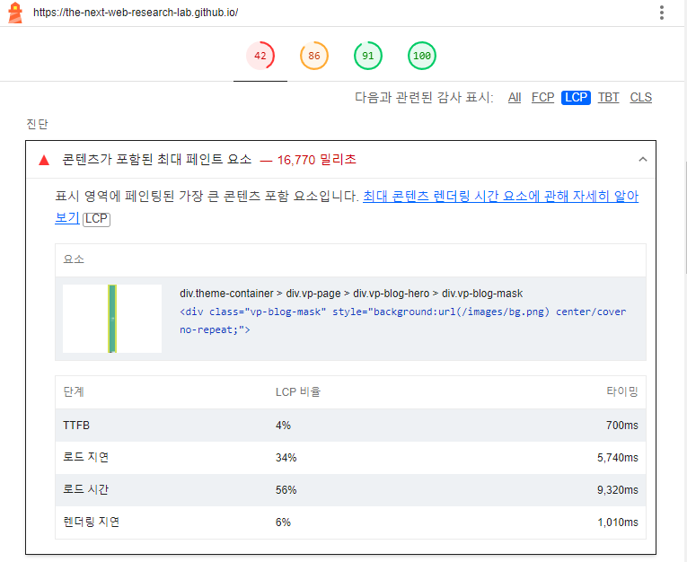
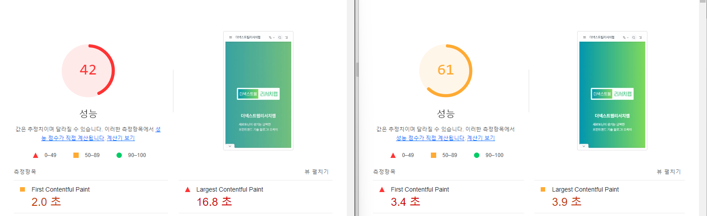
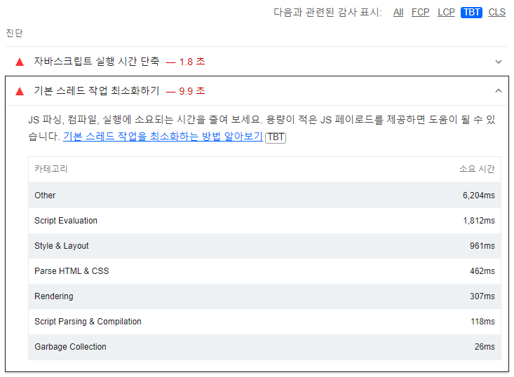
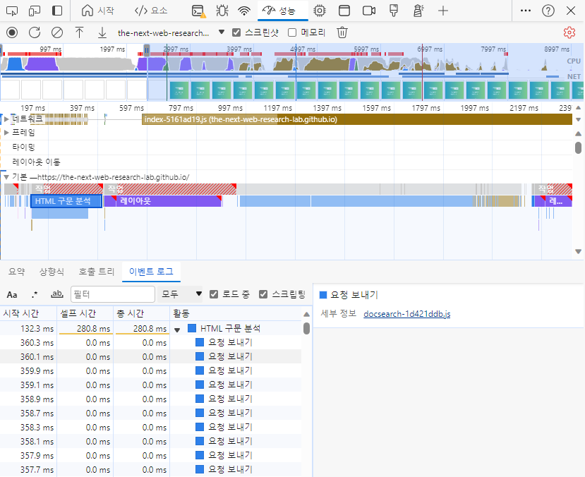
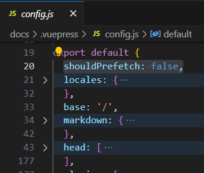
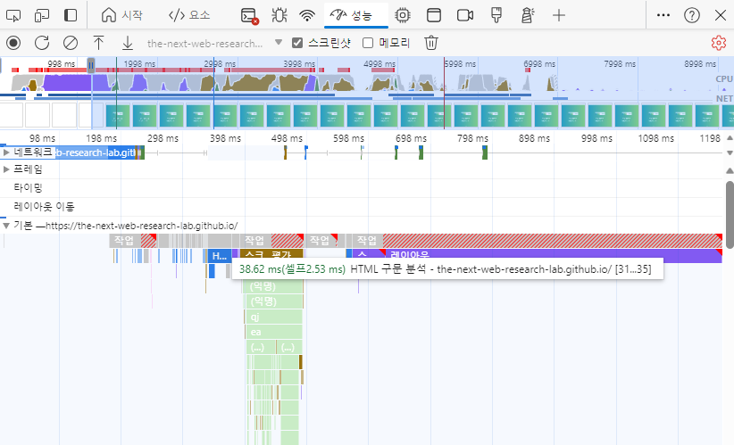

# {Lighthouse Deep Dive} Performance optimization process (ft. LCP, TBT optimization)
I happened to measure the blog's performance with Lighthouse, and the performance score was measured to be around 40 points, indicating poor performance, so I decided to optimize the performance. 🫡

First, I will show the performance optimization results and then explain how to find problems and solve them.

index
- 📄Performance optimization results
- 🖼️LCP Optimization
- 💻TBT Optimization

## 📄Performance optimization results

This is the result of performance optimization after measurement by Lighthouse with a mobile device.

Largest Contentful Paint (hereinafter referred to as LCP) and Total Blocking Time (hereinafter referred to as TBT) were very poor.

There are two main points of improving web page performance: (1) resources and (2) main thread. Resource improvement is simpler than main thread improvement, and LCP is greatly affected by resource improvement, so start with LCP first.

### 🤔What is Speed ​​Index?
Speed ​​Index naturally improves by improving four items, from First Contentful Paint to Cumulative Layout Shift. So the Speed ​​Index is not improved here. It is recommended that improvements be made last when optimizing performance in the future.

## 🖼️LCP Optimization
First of all, LCP (Largest Contentful Paint) refers to the largest image or text area on a web page.

### 🔎How to find problems

If you select the LCP tab in the diagnosis area of ​​the Lighthouse report, it will tell you what areas need improvement. If you look at the first item, you can see that the LCP is not good due to the background image effect.

The background image was used because of the gradient background, but since there is a delay in image loading and rendering, it seems that this will be improved by changing to a gradient using CSS.

### 🪄Problem Solving

As shown above, the background was changed to be drawn using CSS.

As a result, LCP was reduced by 12.9 seconds, and the previously incorrectly applied gradient UI bug was also resolved.

Next, we will improve the TBT items related to the main thread. First Contentful Paint (hereinafter referred to as FCP) can be naturally improved by optimizing the main thread, so proceed with FCP before TBT.

## 💻TBT Optimization
TBT (Total Blocking Time) refers to the total blocking time of the main thread. Main thread blocking operations between first content rendering and interaction start are included in the calculation.

### 🔎How to find problems

If you look at the second diagnosis, you can see that the Other item takes an abnormally long time. I thought this part was a problem related to JavaScript file requests and debugged it through the performance tab.

I checked the performance tab and found that "HTML parsing" was taking an unusually long time. When I checked "HTML parsing" closely, I found that `<link rel="prefetch">`it was requesting JavaScript files for all pages.

The blog had over 300 pages, so that many JavaScript files were being requested in advance. Prefetch needed improvement because it had a negative effect on performance when requests increased.

### 🪄Problem Solving

I set prefetch to be removed in the build settings. Because fast initial loading is more important, prefetch was removed first.

After removing prefetch, we were able to remove the pre-requesting JavaScript, and "parsing HTML" became a task that didn't block the main thread.

As a result, TBT returned to a stable state, and FCP improved during the TBT improvement process.👏

Above we have looked at the performance optimization process using Lighthouse. Improving a web page is often simpler than you think, so give it a try if you have no experience.👍