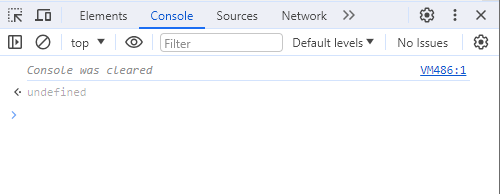
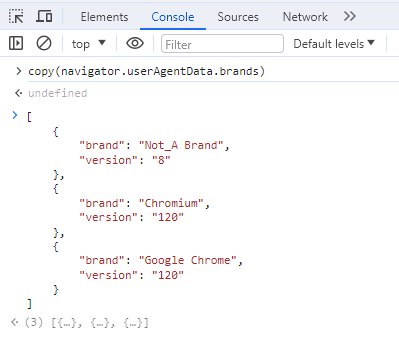
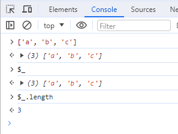
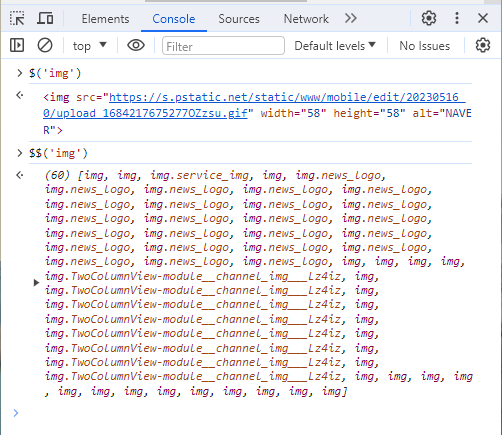

# {개발자도구} Console 탭 유틸 함수
개발자도구에 있는 Console 탭에서 디버깅에 유용한 유틸 함수를 제공합니다.

오늘은 알고 있으면 언젠간 써먹을 Console 탭 유틸 함수를 알아보겠습니다.

목차
- clear(): 콘솔 로그 모두 제거하고 싶을 때
- copy(param): 복사하고 싶을 때
- $_: 이전 실행 결과값 참조하고 싶을 때
- $(selector), $$(selector): DOM 참조하고 싶을 때

## clear(): 콘솔 로그 모두 제거하고 싶을 때

clear() 함수는 현재 콘솔 패널에 표시되고 있는 로그들을 모두 제거합니다.
로그를 모두 제거하고 새로운 작업을 하고 싶을 때 유용합니다.

clear() 실행 후에는 Console was cleared와 같은 문구가 표시됩니다.

## copy(param): 복사하고 싶을 때

copy(param)은 param에 있는 내용을 복사합니다. 자바스크립트 실행 결과값을 복사하고 싶을 때 유용합니다.
테스트 케이스에서 사용할 목업 데이터를 만들때도 사용하곤 합니다.

## $_: 이전 실행 결과값 참조하고 싶을 때

$_는 이전 실행 결과값을 참조하고 싶을 때 사용합니다.

배열을 디버깅할 때 배열을 먼저 실행하고 $_로 참조할 수 있습니다.

## $(selector), $$(selector): DOM 참조하고 싶을 때

$(selector), $$(selector)는 DOM을 참조하고 싶을 때 사용합니다.
$(selector)는 document.querySelector와 유사하고, $$(selector)는 document.querySelectorAll과 유사합니다.

이상으로 Console 탭 유틸 함수를 알아봤습니다.

여기서 소개한 유틸 함수 이외도 다양한 함수들이 있으니 궁금하신 분들은 아래 링크 참고바랍니다.

[https://learn.microsoft.com/en-us/microsoft-edge/devtools-guide-chromium/console/utilities](https://learn.microsoft.com/en-us/microsoft-edge/devtools-guide-chromium/console/utilities)

감사합니다.