# FE개발자가 정리한 디자인 가이드
### 글의 목적
> 규칙을 전부 마스터하면 뭐든지 할 수 있다. 심지어 규칙을 파괴할 수도 있다. 
그런데 체계가 아예 없으면 시작조차 할 수 없다. ― 에드워드 펠라 (Edward Fella, 현 미국 칼아츠의 디자인교수, 디지털 그래픽 디자인의 선구자)

디자인을 주간적인 감각이 뛰어난 사람만 잘 할 수 있다는 의견들을 많이 들었습니다.
하지만 디자인은 단순히 감각적으로 하는 것이 아닌 객관적인 근거를 바탕으로 디자인을 하는 것입니다.
이 글에서는 디자인 요소들을 작업할 때는 각 요소별로 **심리학적**으로 접근하는 방법과 **통계적**으로 접근하는 방법을 설명합니다.

### 개요
- 레이아웃
- 색상
- 타이포그래피
- 사진편집
- UI 컴포넌트
- 강조하기

### 레이아웃
> "전체는 단순히 부분의 합이 아니다" - Kurt Koffka 쿠르트 코프카(독일 심리학자) 
이 말은 매우 간단히 말해 주고 있다. 우리는 사물의 그룹을 볼 때, 각각의 사물들을 보기 전에 전체적인 모습을 인지합니다. 사물이 분리되어 존재하더라도, 부분 이전에 하나의 전체를 보는 것이다.

레이아웃은 균일한 요소와 간격을 사용하여 화면 크기에 **일관성** 부여에 목적이 있습니다.
공간구성의 일관성은 사용자에게 **심리적 안정감**을 제공할 것이며,
컨텐츠와 형태를 유기적으로 연관지어 상징성을 부여하게 됨으로써 정보의 성격을 예상할 수 있도록 도와줍니다.
형태를 통한 정보의 예측은 결과적으로 정보처리과정의 간소화를 의미하기에
사용자가 보다 빠르고 쉽게 앱의 기능에 접근할 수 있게 할 것입니다.

#### 규칙 세우기
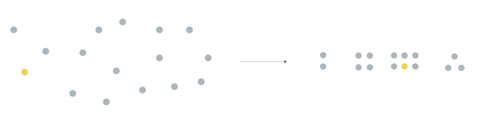

사람은 모호하거나 복잡한 이미지를 가능한 단순한 형태로 인지합니다.
우리는 단순하고 명료하고 정돈된 것을 좋아합니다.
본능적으로 이런것들이 안전하다고 느끼기 때문입니다.
단순한 형태는 인식하는데 오래 걸리지 않습니다.

#### 그리스 시스템
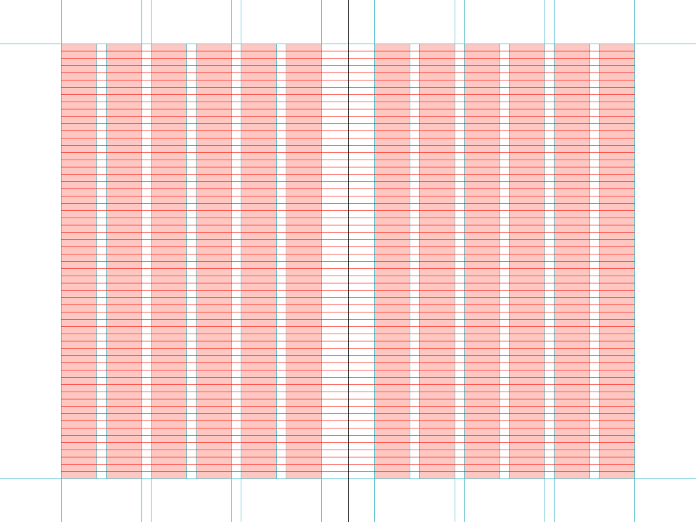

그리드 시스템은 페이지를 구성하는 정보를 의미있고 논리적으로 일관성있게 구성하는 것을
중요시하는 그래픽 디자이너에게 도움을 주는 정밀한 **프레임워크**입니다.
그리드 시스템의 초기 버전은 중세 시대에서부터 존재했지만,
대부분의 그래픽 디자이너들은 프린트 디자인 결과물 제작 과정에서
영감을 얻어 페이지 레이아웃에 대한 정밀하고 일관된 시스템을 구축하기 시작했습니다.

이후 그리드에 대한 철저한 분석을 담은 스위스의 그래픽 디자이너 요제프 뮐러 브로크가
저술된 책 [Grid Systems](http://monoskop.org/images/a/a4/Mueller-Brockmann_Josef_Grid_Systems_in_Graphic_Design_Raster_Systeme_fuer_die_Visuele_Gestaltung_English_German_no_OCR.pdf)의 발표로 그리드 시스템에 관한 지식이 전 세계적으로 전파되는데 있어 큰 기여를 이룹니다.

### 색상
디자인에 있어서 컬러 시스템이 인터페이스에 적용될 때에는 체계적이고 합리적인 방식이 필요합니다.
기본적으로는 모든 색상은 텍스트의 가독성을 저해하지 않는 것을 전제로 해야 하기 때문에 
대표 색상과 보조 색상들의 조화로운 조합이 요구되며,
동시에 모든 인터페이스 요소를 효율적으로 구분해 줄 수 있는 **가시성**을 가져야 합니다.

#### 색상 심리학으로 대표 색상 선택
**색상 심리학**은 인간이 느끼는 감성과 미적 반응을 연구하여 색상의 기본적인 특성을 정의합니다.
**대표 색상**은 색상 심리학을 통해 색상을 선택하여 브랜드 아이덴티티를 표현할 수 있습니다. 

#### 유사배색으로 보조 색상 선택
**유사배색**은 색상의 차이가 근접하거나 유사한 배색을 말합니다. 빨강과 노랑/주황, 파랑과 남색 등 이러한 배색들이 있습니다.
**보조 색상**은 유사배색을 통해 대표 색상과 유사한 배색을 선택하며, 강조하고 싶은 요소에 사용하여 포인트 색상이라고도 합니다.

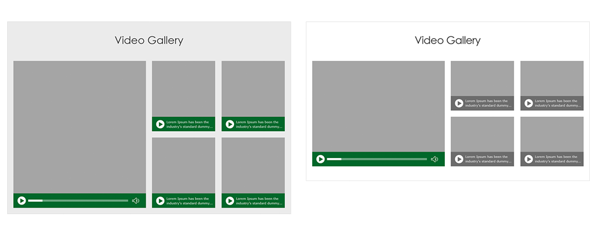

#### 대표/보조 색상 기반 색상 팔레트 색상 선택
**색상 팔레트**는 색상 전문가들이 정리한 색상 배색으로 대표 색상과 심미적으로 어울리는 보조 색상을
팔레트에 정의한 것 입니다. 대표적인 참고할 사이트는 [Design Seed's](https://www.design-seeds.com/blog/)가 있습니다.

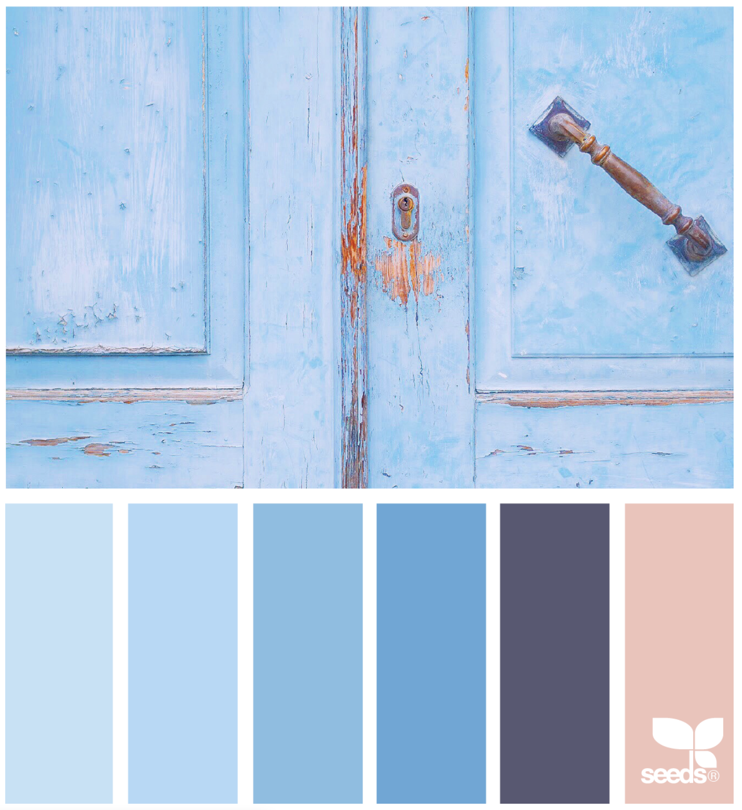

### 타이포그래피
타이포그래피는 문자 배열, 문자 디자인과 문자 상형을 수정하는 기술입니다.
상형문자는 창조되고 다양한 일러스트레이션 기법으로 수정됩니다.
글자의 정돈은 폰트, 폰트 사이즈, 문장의 길이, 문장 사이의 간격과 단어 사이의 간격을 포함합니다.

#### 타이포그래피 디자인 원칙
타이포그래피는 브랜드 아이덴티티를 상징하는 요소중 하나 입니다. 즉, 폰트 스타일만으로도 브랜드를 알 수 있는 요소입니다.
이 상징적인 요소가 많으면 아이덴티티는 모호해집니다. 폰트 스타일은 최대 2개를 초과하지 않게 해야 합니다.

#### 가독성 조절 원칙
**가독성**은 글이 쉽게 읽히는가 하는 능률의 정도를 말합니다. 가독성에 영향이 있는 요소들은 글꼴, 자간, 줄 간격, 띄어쓰기에 달라지며 각 요소의 원칙들을 알아보겠습니다.

**자간**은 좁을 수록 가독성이 높아집니다. 기본적으로 `-100`를 사용하는 것을 추천합니다.

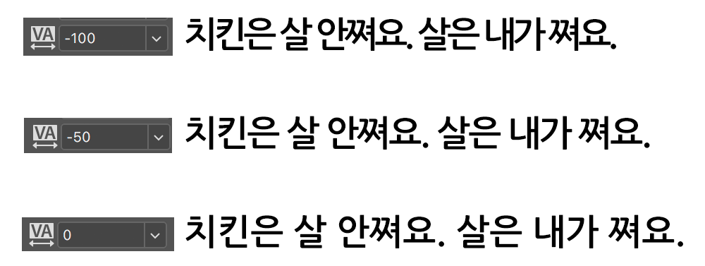

**줄간격**은 넓을 수록 가독성이 높아집니다. 기본적으로 `150%`을 사용하는 것을 추천합니다.

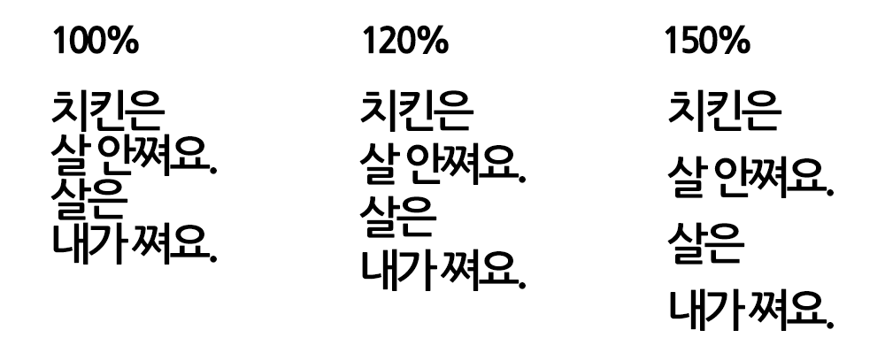

**두께**는 얇은 것보다 적당히 두꺼운 것이 좋습니다. 기본적으로 `Bold`를 사용하는 것을 추천합니다.

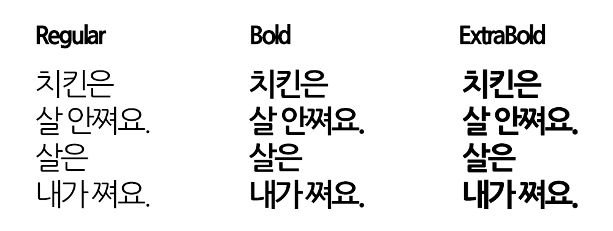

### 사진편집
웹 디자인의 이미지 컨텐츠가 잘 만들어 졌다는 것은 이미지를 잘 사용했다는 것입니다. 이미지를 잘 사용했다는 것은 사진을 캔버스에 사용자들이 보기 좋게 배치한 것입니다. 사진을 보기 좋게 배치를 하기 위해서는 기본적인 사진 구도를 알고 배치를 하는 것이 중요합니다.

#### 사진의 수평과 수직을 맞춰라
풍경사진, 그 중에서도 바다 수평선을 배경을 떠오르는 태양을 찍는다면 반드시 수평선에 수평을 맞추는 게 좋습니다. 약간이라도 수평선이 기울어져 보이면 그대로 뜨는 해가 굴러 떨어질 것 같은 불안감이 생기는 것은 물론이고 어색한 사진이 되고 맙니다. 사람사진에서도 마찬가지입니다. 사람사진은 가로사진보다는 세로사진을 찍는 경우가 많은데, 이 경우 수직으로 찍어서 불안정해 보이지 않게 하는 게 좋습니다.

#### 피사체 가운데두기
피사체를 중앙에 배치하는 것은 다소 밋밋하다고 생각될 수 있지만 보는 이의 시선이 변함이 없고, 그대로 집중 할 수 있는 구도입니다.
하나의 주피사체를 부각시키는 데 많이 사용되어 인물 클로즈업 사진에 많이 쓰이기도 합니다.

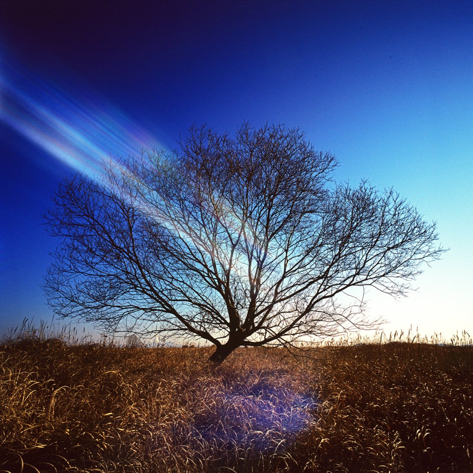

#### 이분할하기
세로 혹은 가로로 이분할하여 배치하는 구도입니다. 시선이 이동하지 않는채 중심선을 기준으로 서로 다른이야기를 담게됩니다.
풍경사진에서의 수평선, 지평선에사 자주 사용됩니다. 또한 불할된 면을 경계로 서로 다른 프레임을 담을 수 있습니다.

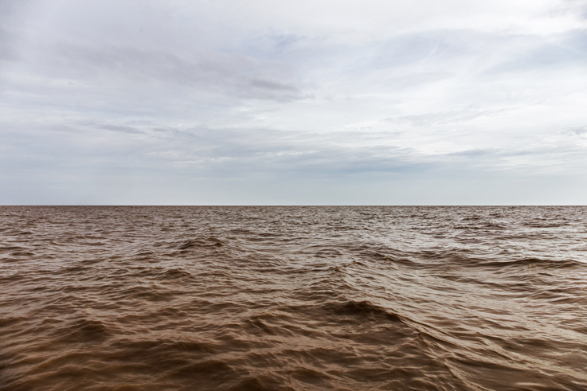

#### 사선으로 담기
사선구도는 피사체의 거리감과 운동감을 잘 표현 할 수 있고 자연스러운 시선을 유도하여 리듬감을 주기에도 좋습니다.

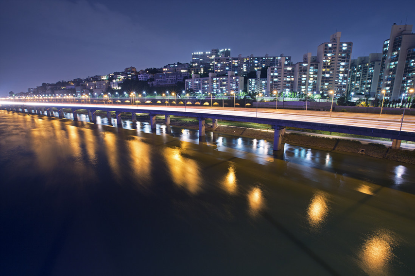

#### 색상과 명암 대비로 텍스트 배치
다양한 필터 나 오버레이 를 사용해서 이미지를 어둡게 하고, 그 위에 밝은 텍스트를 겹치게 하는 것이 비교적 명쾌한 방법처럼 여겨집니다

다음 이미지에서 꽃 위에 겹쳐진 텍스트를 한 눈으로 알아보기가 얼마나 어려운지 보이실 것입니다. 흰색 텍스트와 사진에서 가장 밝은 영역 사이의 대비는 쉽게 문자를 구분하지 못하도록 방해만 합니다. 누가봐도 좋지 않은 결과물입니다.

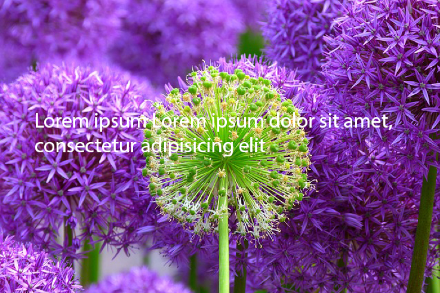

이렇게 이미지를 조금 어둡게 바꿔보면 훨씬 읽기 쉬워집니다.

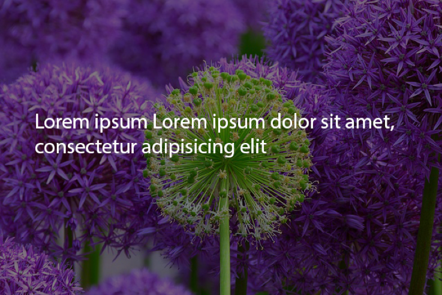

#### 크기와 위치에 따른 텍스트 배치
이미지의 색상과 대비를 조치하면 겹쳐진 텍스트와의 관계를 개선할 수 있습니다. 그리고 또 하나 중요한 사실은 텍스트 크기와 위치만으로도 그 자체의 가독성을 높일 수 있습니다. 같은 이미지에서 텍스트 위치를 변경하는 것만으로도 그 가독성이 얼마나 향상되는지 한번 살펴보겠습니다.

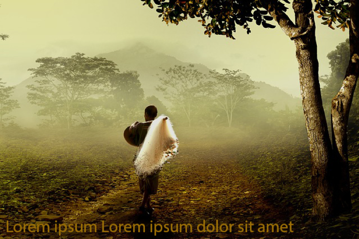

위 이미지에서 주변 땅바닥과 비슷한 색상과 더불어 아래에 배치한 텍스트 구성은 보기에 좋지 않은 영향만 미칩니다.

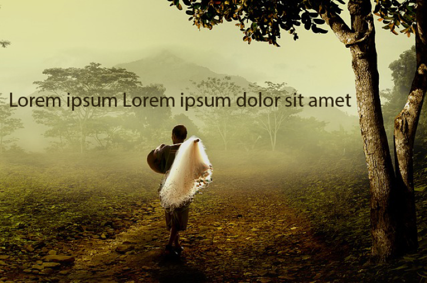

텍스트를 사진 아래에서 위로 옮기기만 하더라도, 훨씬 읽기 쉽고 눈에 확 띄게 정리를 할 수 있습니다.

#### 인물 확대하기
불필요한 주변 물체를 없애고 배경을 더욱 아웃포커스하여 중심 인물만 강조할 수 있습니다.
피사체에 근접하여 상반신을 확대한 것으로, 피사체가 더욱 돋보이고 강한 인상을 주는 사진이 완성되었습니다. 가까운 거리에서 배치함으로 인해 배경이 더욱 아웃포커스되고 소녀의 인상이 강조되었습니다. 

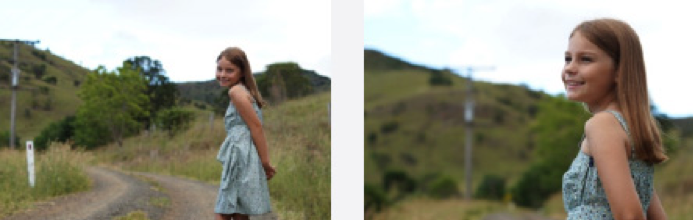

#### 인물 구도 짜기
구도를 변경하면 같은 피사체를 배치하더라도 사진의 분위기가 크게 바뀔 수 있습니다.
간편하게 사진을 배치할 때 우리는 피사체를 프레임 중앙에 놓는 경우가 많습니다. 하지만 인물 사진을 찍는다면 **1/3의 원칙** 구도를 적용하면 좋습니다.

**1/3의 원칙** 구도는 프레임을 9등분(가로 3 x 세로 3)하여 주 피사체를 분할선의 교차점에 배치하는 구도로, 인물 사진의 경우 얼굴의 가운데 또는 눈을 교차점 위치에 놓습니다.

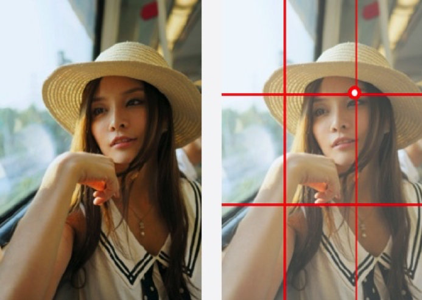

### UI 컴포넌트
**UI 컴포넌트**는 레이아웃, 색상, 타이포그래피 원칙들을 모두 적용한 결과물입니다. 웹사이트에서는 버튼, 링크, 입력 박스 등 요소들이 동일한 디자인으로 사용되어야 합니다.

#### 버튼
버튼은 중요한 기능에 따라 색상을 다르게 합니다. **저장**과 같은 중요한 기능은 **대표 색상**을 사용하고, **취소**와 같이 비교적 중요하지 않는 기능은 **보조 색상**을 사용합니다. 그리고 사진위에 버튼을 사용할 때는 배경이 없고, 테두리만 있는 **고스트 버튼**을 주로 사용합니다.

**링크**는 밑줄만 사용하는 것으로 링크라는 의미를 부여할 수 있습니다. 버튼과 같은 맥락으로 중요한 정보에 따라 색상을 다르게 합니다.

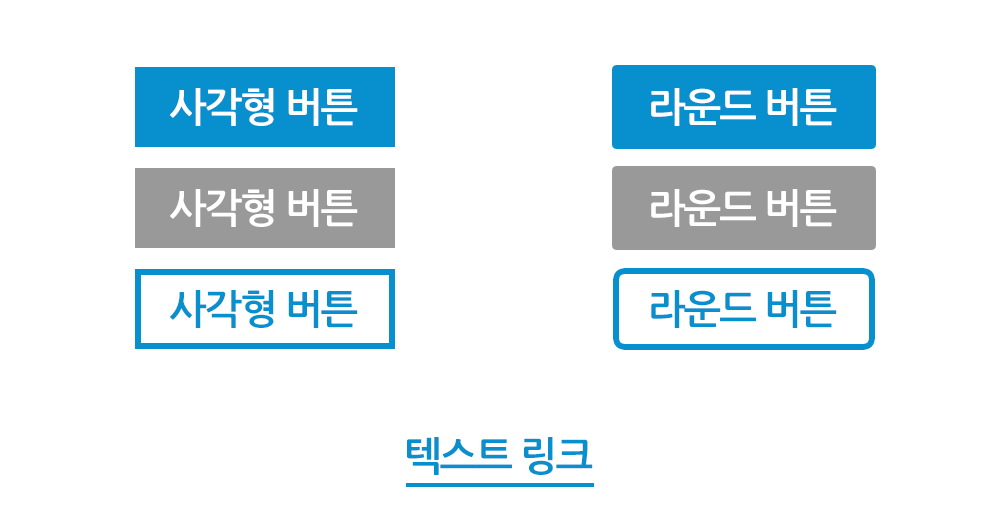

#### 입력 박스
입력 박스는 일반적으로 회색 테두리를 사용합니다. 강조가 필요할 때 대표/보조 색상을 통해 강조합니다.

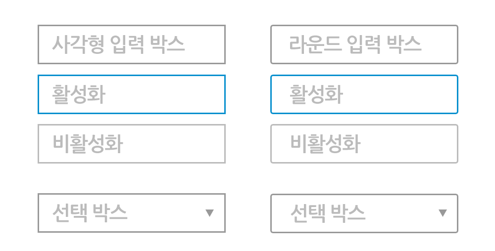

#### 가로 정렬 맞추기
양쪽 끝에 균형을 맞추면 안정적으로 보입니다.

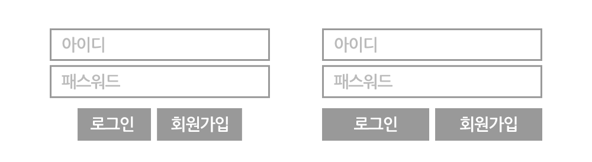

#### 세로 정렬 맞추기
세로 간격을 맞추면 그룹이 명확해 집니다.

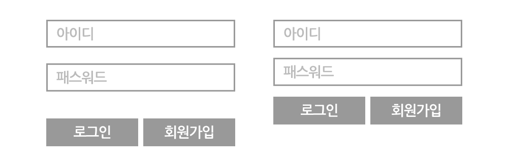

### 강조하기
2013 독일기능올림픽 출전 시, 디자인 과제에서 사용했던 스킬입니다.

#### 정적 -> 동적
정적인 이미지에 동적인 느낌을 부여하고 싶었습니다. 그래서 화살표를 끝에 배치하였습니다.

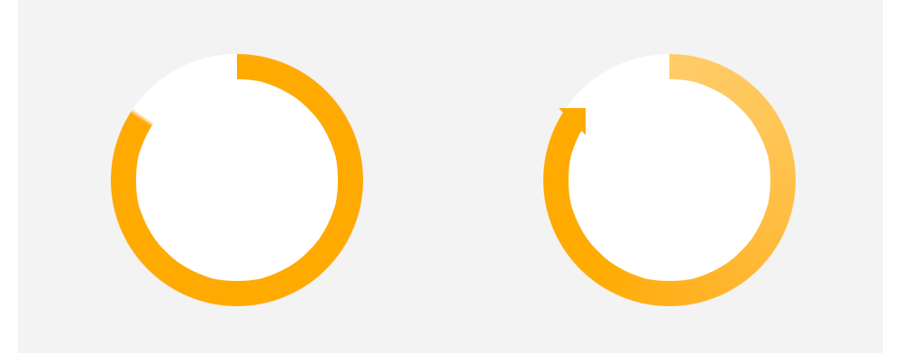

#### 쉬운정보전달
사람에 대한 정보 전달이 목적입니다. 그래서 막대기 대신 사람아이콘을 사용했습니다.

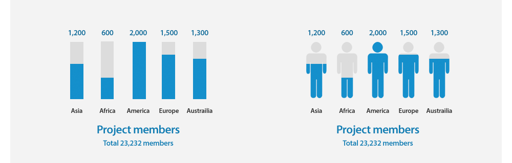

#### 수치전달
수치적으로 어떤 차이가 있는 지 전달하기 위해 숫자를 사용했습니다. 그리고 눈의 띄는 게 중요하기 때문에 색상과 모양을 수정하였습니다.

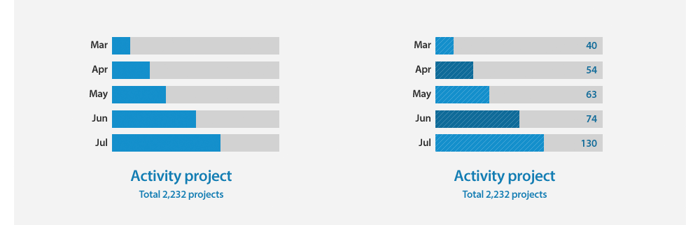
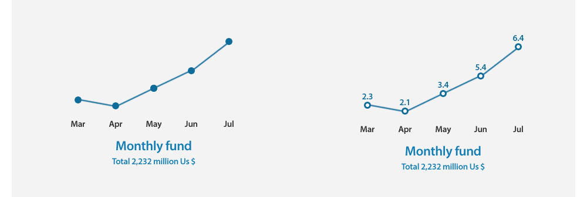