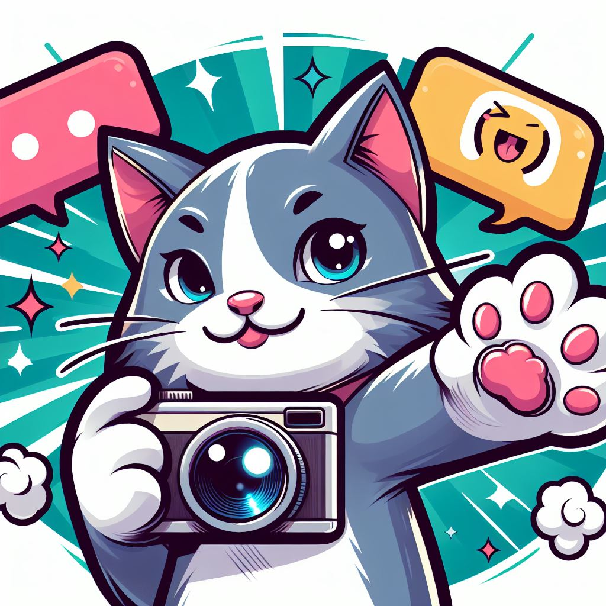

# 개발자와 대화하는 방법?

회사에서 개발자와 같이 일을 할 때 대화가 어려웠던 경험이 있으셨나요?

개발자가 된지 얼마 안 됐을 때 그런 경험이 있었는데요.
그런 경험이 있으셨다면 서로 전문성이 다르기 때문에 그런 일이 생겼을 거라 생각합니다.

이 포스트에서는 대화가 잘 안되는 이유와 대처 방법에 대해서 정리해 봤습니다.

## 용어에 대해 이해하기 어려울 때

개발자와 비개발자는 기술 용어와 개념에 대한 이해 수준이 다르기 때문에 소통에서 오류가 발생할 수 있습니다.

이를 대처하기 위해서 서로가 이야기한 용어와 개념을 알도록 노력하고, 이해하지 못할 때는 질문하고 설명을 듣는 것이 좋은 방법입니다.

## 무언가 모호할 때

기능이나 서비스에 대한 설명이나 요청이 모호할 경우, 상대방은 작업의 일부를 추측해야 하며, 이로 인해 예상과 다른 결과를 낼 수 있습니다.

이를 방지하기 위해 모든 단계를 검토하고 명확하고 구체적인 요청을 하는 것이 중요합니다.

## 충분한 정보가 부족할 때
협업하는 한, '하나의 팀'으로 생각하고 충분한 정보를 공유하는 것이 좋습니다. 특히, '왜 이것을 요청했는지' 설명하는 것이 무엇보다 중요합니다.

제공하는 정보가 많을수록 결과는 목적에 더 충실하게 되며, 때로는 상대방으로부터 더 나은 제안을 받을 수 있습니다.

## Episode: 기획자와 개발자의 사고 과정 차이

인스타그램에서 일상의 사진을 업로드하는 기능을 넣는다면 기획자와 개발자는 어떻게 사고할까요? 

기획자는 사진 업로드 기능이 필요한 이유를 설명하고 화면을 설계하며, 개발자는 사진 업로드와 관련된 기술적 문제를 고민합니다.

기획자는 문서로 생각을 표현하고, 개발자는 논리로 접근합니다.

이와 같이 서로 다른 전문성을 가지고 있어 대화할 때 맞춰가는 과정이 필요합니다.

## 마치며
함께 일하는 동료와 '하나의 팀'으로서 서로를 이해하고 존중하는 것이 가장 중요합니다.

상대가 개발자가 아니라 다른 직군이도 해당 직군을 이해하고 적용하면, 더 나는 협업과 더 좋은 결과를 얻을 수 있습니다.
