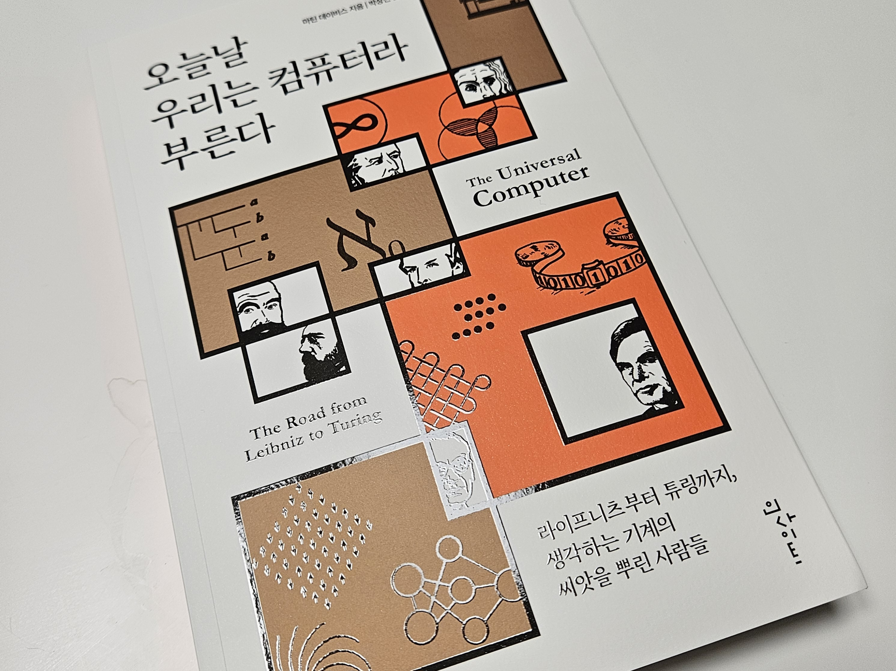

# 오늘날 우리는 컴퓨터라 부른다
> 해당 도서 출판 이전에 인사이트 출판사에서 도서를 지원받아 작성한 리뷰입니다.

## 출처
『오늘날 우리는 컴퓨터라 부른다』| 마틴 데이비스 저/박상민 역 | 인사이트(insight) | 2023년 08월 25일

## 한 줄 리뷰
인물들이 살고 있는 시대적인 상황과 인물들이 발견한 논리학과 수학을 상세하게 정리한 도서

## 요약
이 책은 현대 컴퓨터의 근간을 이루는 아이디어를 발견한 사람들의 이야기를 다룬다. 300년 전으로 거슬러 올라가 라이프니츠, 불, 프레게, 칸토어, 힐베르트, 괴델, 튜링의 태생과 업적에 대한 자세한 역사를 엿볼 수 있다.

그리고 범용 컴퓨터의 기반이 된 폰 노이만과 튜링을 다룬다. 폰 노이만은 18,000개의 진공관으로 구성된 애니악에 기여했으며, 복잡한 수리 계산을 수없이 반복하는 고전적 방식의 수리 계산 기계를 추구했다. 반면에 튜링은 1,500개의 진공관으로 구성된 콜러서스에 기여했으며, 비교적 간단한 기계를 제안했고, 기능이 많은 나머지 부분은 소프트웨어가 해결하도록 했다.