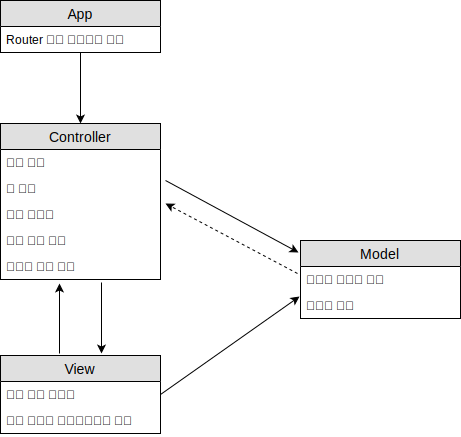

# MVC 정리
## MVC
MVC는 역사상으로 두가지가 있다. 첫번째는 초기에 XEROX PARC에서 발표된 것으로 사용자가 도메인 정보를 직접 보고 조작하는 것을 목표로 하는 MVC였다. View가 Model에 직접 데이터를 요청했으며 Controller는 사용자 상호작용을 담당했다. 두번째는 현대의 MVC이다. 현대의 MVC는 View는 Model과 간접적인 관계이다. View는 Controller를 통해 Model의 데이터를 전달 받게 된다. 그리고 Controller는 사용자 상호작용을 View에게 위임받는다.

### 초기의 MVC
MVC의 기본 목적은 사용자의 멘탈모델과 컴퓨터에 존재하는 디지털 모델 간의 차이를 연결하는 것이다. 이상적인 MVC 솔루션은 사용자가 도메인 정보를 직접 보고 조작하는 착각을 지원한다.

Model은 도메인 데이터를 의미하며 순수한 데이터의 역할을 한다. Controller는 사용자의 상호작용 담당을 한다. View는 프레젠테이션을 담당한다.

Controller는 View를 생성하는 책임이 있으며 Controller는 View와 1:N의 관계다. View와 Model 관계는 N:N의 관계이다.

### 현대의 MVC
컨트롤러는 모델과 직접적인 관계이다. 모델은 컨트롤러를 모르고 컨트롤러는 모델을 생성하는 책임이 있다. 모델은 순수한 데이터 원형을 이야기한다. 모델은 변화가 일어났을 때 컨트롤러에게 알려준다. 결합도를 줄이기 위해 옵져버 패턴으로 모델과 컨트롤러가 연결되어 있다. 컨트롤러는 뷰도 생성한다. 컨트롤러는 뷰에게 모델에게 받은 데이터를 전달한다. 뷰는 모델에 기반하여 렌더링 처리한다. 뷰에게 사용자 입력의 처리를 컨트롤러에게 위임을 한다. 컨트롤러는 뷰에게 위임받은 액션을 대신 처리하게 되고 모델에게 데이터 요청을 하게 된다.

그럼 누가 컨트롤러를 생성할까. 컨트롤러의 생성은 라우터에서 하게된다. 상황에 따라 컨트롤러를 생성한다. 라우터에 따라 동작해야 하는 역할을 결정하여 컨트롤러를 생성하게 된다. 모델과 뷰가 분리된 이유는 변화율이 다르기 때문에 두가지를 분리한다.

현대의 MVC패턴의 컨트롤러는 책임이 많기 때문에 컨트롤러 볼륨이 커진다. 이것은 MVC의 단점이기도 하다. 이 부분을 해결하기 위해서는 컴포넌트로 분리한다. 컨트롤러를 컴포넌트로 분리하여 볼륨을 작게 만든다.

뷰를 만들 때는 굉장히 광활하다. 컨트롤러가 순수한 데이터를 뷰에게 전달하기 때문이다. 프런트 엔드 개발할 때는 순수한 데이터를 뷰에게 표시하는 역할에 비중이 크고, 백 엔드 개발할 때는 모델의 비중이 크다.

컨트롤러는 라우터를 알고 있다. 그 이유는 컨트롤러가 다른 컨트롤러에게 일을 시킬 때 필요하다. 컨트롤러를 다른 컨트롤러를 모른다. 그렇기 때문에 라우터를 통해서 컨트롤러를 찾아달라고 요청하게 된다. 라우터는 역할에 맞는 컨트롤러를 상태로 가지고 있다. 필요할 때 해당 컨트롤러를 실행해준다.

컨트롤러는 모델을 생성하고 청취한다. 그리고 뷰를 생성한다. 컨트롤러에서 모델의 변경을 감지하면 뷰에게 새로 렌더링하도록 요청한다. 컨트롤러는 본인의 역할이 아는 것은 라우터를 통해 컨트롤러를 요청한다.
현대의 컨트롤러와 뷰는 1:1관계이다.

