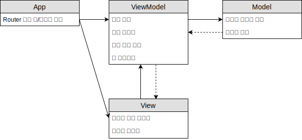

# MVVM 정리
## MVVM
MVC에서 파생되는 패턴들은 모델과 뷰 사이에 무언가를 넣는 것이다. 뷰를 가상화하는 프록시를 가짐으로서 뷰와 모델간의 관계를 끊는 다. 모델의 데이터 형태가 뷰에게 의존이 생기기 때문에 모델의 변경이 필요할 때는 뷰까지 변경이 이뤄짐으로 변경을 할 때 비용이 많이 든다. 그래서 모델의 데이터 형태와 뷰 렌더링을 위한 데이터 형태를 분리하기 위해 객체를 만들어서 의존성을 해결한다. 뷰를 위한 데이터이기 때문에 뷰모델이라고 부른다. 뷰와 뷰모델은 양방향 바인딩이 이뤄진다. 뷰와 뷰모델은 변경이 되었을 때 서로 변경이 됬음을 알려준다.

Model과 View는 MVC에서 정의된 역할과 동일합니다. Model은 상태저장, 비즈니스 로직, 순수한 데이터입니다. View는 시각적인 요소를 담당합니다.

ViewModel는 View가 데이터 바인딩에 사용할 수 있는 Model을 전문화합니다.
- Model Type을 View Type으로 변환하는 데이터 변환기 역할
- View가 Model과 상호작용 할 수 있게 하는 역할
- UI의 재사용 가능한 부분에 대한 추상적 표현
- Selection과 Commands를 포함

