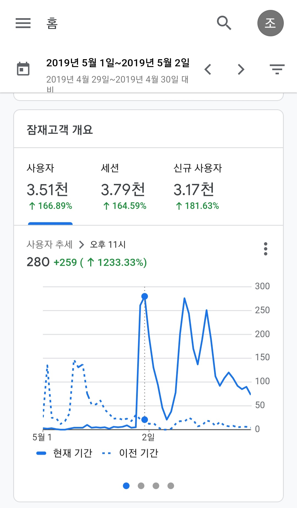

# since 2019.05, 4년간 고민한 좋은 코드에 대한 결론
## 들어가며: 좋은 코드에 대해 계속 고민한 이유
2019년 5월 1일 저녁에 페이스북 어느 한 그룹에 "이해하기 쉬운 코드 작성방법 정리"라는 포스트를 공유했었다. 그 포스트는 카카오 재직 중 일 때 FE 개발팀 주간회의에서 발표를 하기 위해 5권 정도의 도서를 참고해서 정리한 자료다. 발표 시간과 발표로 설명하기 어려운 내용들이 있었는데 그 아쉬움을 해결하기 위해 개인 블로그에 포스팅 후 페이스북에 공유했었다.

저녁에 포스팅한 거라 다음날에 구글 애널리틱스를 확인해 보고 깜짝 놀랐다. 이틀 정도 만에 약 3500명 정도가 포스트를 본 것이다.



그날 이후로 좋은 코드에 대해 관심 있는 개발자들이 많다고 느꼈고 좋은 코드에 대해 계속 고민하게 되었다.

## 2023 좋은 코드에 대한 결론
현재 내가 얻은 좋은 코드에 대한 결론은 "같이 일하는 동료와 함께 결정한 코드"가 가장 좋은 코드라고 생각한다.

도서를 통해서 작성된 좋은 코드에 대한 코드는 통계적이고 경험적으로 얻어진 결론이다. 하지만 대체로 5명 이하의 동료들과 함께 같은 코드를 보게 된다. 아무리 좋은 코드라고 소개된 코드라도 같이 일하는 동료들이 보기 어렵다면 좋은 코드라고 항 수 없다.

하나의 사례를 예를 들면 자바스크립트 객체 해체 관련 코드다.

변경하고 싶은 코드는 이런 형태의 코드였는데, 나는 this.obj.innerObj가 중복이라고 판단하고 해결하고 싶었다.
```js
const result = {
  name: this.obj.innerObj.name,
  age: this.obj.innerObj.age,
  count: this.obj.innerObj.count,
};
```

나는 1안으로 내가 선호하는 코드를 작성했고 두 가지 정도 다르게 작성해서 2안, 3안을 함께 투표를 했다.

#### 1안: 내가 변경한 코드, 선호도 낮음
```js
const {
  obj: {
    innerObj: {name, age, count}
  }
} = this;
const result = {name, age, count};
```

#### 2안: 가장 선호도 높음
```js
const {innerObj} = this.obj;
const result = {
  name: innerObj.name,
  age: innerObj.age,
  count: innerObj.count,
};
```

#### 3안: 두 번째 선호도 높음
```js
const {
  innerObj: {name, age, count}
} = this.obj;
const result = {name, age, count};
```

결과적으로 내가 좋은 코드라고 생각한 코드와 동료들이 생각하는 코드는 달랐다. 내가 좋은 코드라고 생각하는 코드라도 동료들이 다르게 느낄 수 있다고 깨닫게 되는 계기가 되었다.

## 마치며
모든 코드를 하나하나 투표해서 결정하는 것은 어려울 것이다. 나는 코드 리뷰를 활용하라고 권장하고 싶다. 일반적으로 코딩 스타일에 대해 코드 리뷰는 감정적인 부분이라 권장하지 않는다고 한다. 하지만 좋은 코드라는 가벼운 주제로 동료들을 이해하고 지속적으로 사용하는 코드를 만드는 계기가 되면 좋겠다.