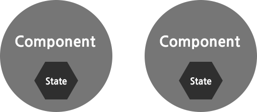
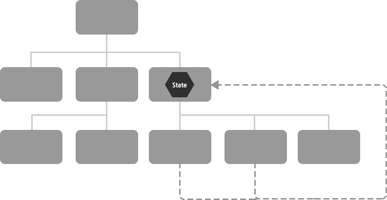

# 코드의 위치를 정하는 기준
> 2019년 5월 19일에 [구조 리펙토링 정리](https://the-next-web-research-lab.github.io/fe-dev/refactoring/structure-refactoring.html) 관련 작업 중에 고민했던 내용들을 정리한 포스트입니다.

### 글의 목적
코드는 만들어진 **목적**과 **역할**이 있기 때문에 **어울리는 자리**가 있다.
**어울리는 자리**에 정확히 있으면 왜 그 자리에 있는 지 이해가 되고 유추가 가능하다.
그런데 막상 코드를 작성할 때 코드가 어떤 자리에 위치해야 하는 지 결정을 못해
**유틸**에 정의하는 경우를 많이 봤다.
코드의 명확한 위치를 정하는 기준에 대해서 알아보기 위해 작성한 글이다.

### 코드의 위치
코드의 위치를 정하는 **기준**은 변수/함수/클래스/컴포넌트/모듈 모두 **동일한 기준**으로 정의된다.
기본적으로 **관계**가 깊은 코드를 그룹핑하고 **영향도**에 따라 **범위를 최소화**하는 것이다.

#### 특정 컴포넌트에만 사용될 때


특정한 컴포넌트에 사용되는 코드는 **해당 컴포넌트에 정의**되야 한다.
**상태관리도구**를 사용하고 있다면 상태관리도구에 정의해야 하는지 혼란스러울 때가 있다.
하지만 코드의 생명주기가 컴포넌트의 생명주기와 동일하다면 컴포넌트에 정의하는 것이 명확하다.
그렇게 되면 영향도가 명확해지므로 코드의 변경이 쉬워지고, 변경 시의 **영향이 해당 컴포넌트로 한정**된다.

#### 특정 모듈에서 다수의 컴포넌트에서 사용될 때


모듈에 소속된 다수의 컴포넌트에서 사용되는 코드는 컴포넌트들의 **공통된 부모**를 찾아 해당 코드를 정의해야 한다.
**공통된 부모**는 구현에 따라 상태머신도구 레벨일 수도 있고 프로퍼티로 데이터를 전달하는 형태일 수 있다.

다수의 위치에서 사용된다고 해서 **유틸**에 정의해야 된다는 판단을 내릴 때가 있다.
**유틸**에 정의하는 것은 소프트웨어 전체에 영향을 줄 때 사용된다.
이러한 경우가 아니라면 범위를 좁혀서 컴포넌트를 관리하는 모듈에 정의하는 것이 좋다.

#### 다수 모듈에서 사용될 때
다수 모듈에서 사용되는 경우는 공통된 부모를 찾으면 **프로젝트 루트 모듈**이다.
이런 경우에 **유틸**에 정의한다. **유틸**에 정의 할 때도 단순히 `utils.js` 같이 사용하는 것보다 `utils` 폴더에 역할별로 정의하는 것이 좋다. 역할별로 정의하게 되면 **응집도**를 높여 연관성 있는 코드만 볼 수 있다.

```
root
├─ utils
│   ├─ date.js
│   ├─ arr.js
│   └─ obj.js
└─ modules
    ├─ timeline
    ├─ sign-in
    └─ sign-up
```

### 코드의 위치를 정하기 위한 아키텍쳐 기본 기법
제대로 소프트웨어 아키텍쳐를 구축하려면 기초가 되는 **몇 가지 원리**에 기반을 두고 수행해야 한다. 이 기본 기법은 소프트웨어 역사 속에서 수많은 프로그래머가 축적해 온 실천적이며 방대한 경험에 기반하고 있다.

#### 캡슐화
관련 있는 데이터와 로직을 그룹핑해서 하나의 모듈을 정의한다. 관계성이 강한 데이터와 로직을 모듈이라는 껍질로 감싸는 것을 **캡슐화**라고 부른다.

그룹핑을 통해 관련 있는 요소끼리만 **특정 추상 개념**을 담당하도록 모듈로 모은다. 이렇게 하면 다음과 같은 장점을 얻을 수 있다.
- 관련 없는 요소가 섞이지 않기 때문에 코드가 읽기 쉬워진다.
- 변경 시의 영향이 모듈 안으로 한정된다.
- 영향도가 명확해지므로 코드의 변경이 쉬워진다.
- 각각 독립된 부품이므로 재사용성이 높아진다.
- 작은 단위로 분할되므로 복잡한 문제에 대처할 수 있다.

#### 정보 은닉
**정보 은닉**은 모듈을 사용하는 클라이언트로부터 모듈의 구현을 숨기는 것을 말한다.

모듈이 클라이언트가 알 필요 없는 내부의 상세 부분을 은닉하면 인터페이스가 작아지고 정보의 교환이 단순해지며 코드 전체의 복잡성을 낮출 수 있다.

정보 은닉을 실현하려면 캡슐화를 사용한다. 캡슐화와 정보 은닉은 원래 다른 개념이다.
- 캡슐화
  - 관계가 있는 요소를 모아 모듈화하는 것이다.
  - 관계가 깊은 데이터와 함수를 한군데로 모은다.
- 정보 은닉
  - 모듈의 내부 상태나 내부 함수를 은닉하는 것이다.
  - 내부에 대한 외부로부터의 직접적인 접근을 차단한다.

#### 패키지화
모듈을 의미 있는 단위로 모든 다음 그룹화한다. 이는 소프트웨어 전체를 의미 있는 단위로 분할하는 것이다. 이렇게 분할된 단위를 **패키지**라고 부른다.

어느 정도 대규모 소프트웨어가 되면 이번에는 대량으로 작성된 모듈이 오히려 복잡성을 낳는 결과를 초래한다.
이것이 바로 패키지다. 패키지화에는 다음과 같은 이점이 있다.
- 소프트웨어 전체가 패키지라는 작은 단위로 분할되므로 복잡도가 낮아진다.
- 패키지 안에 관련 없는 모듈이 섞이지 않으므로 모듈을 관리하기 쉬워진다.
- 수정에 대한 영향도가 패키지 안에 머무를 가능성이 높으므로 코드를 변경하기 쉬워진다.
- 종속 관계가 정리되어 패키지 단위로 재사용하기 쉬워진다.

#### 관심의 분리
**관심**이란 소프트웨어의 **기능**이나 **목적**을 뜻한다. 관심을 분리한다는 것은 각각의 관심에 관련된 코드를 모아 독립된 모듈로 만들어 **다른 코드로부터 분리**한다는 뜻이다.

설계 기법에서 패턴의 대부분은 관심의 분리를 실현하려는 목표를 가지고 있다. 가장 대표 적인 패턴이 **MVC 패턴**이다.
**MVC 패턴**에서는 비즈니스 로직, 사용자에 대한 표시, 입력 처리를 분리한다.

### 끝
소프트웨어 프로젝트 비용 중 대다수는 유지보수에 들어간다.
소프트웨어는 요구사항이 추가될 수록 점차 복잡해지면서 유지보수 시간이 점점 늘어난다.
코드가 명백할 수록 이해하기 쉽고 유지보수 비용이 적게 들기 때문에
코드의 위치를 명확히 하는 것을 권하고 싶다.
