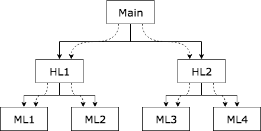
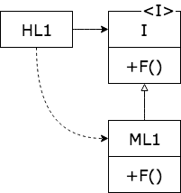

# 의존성 역전! 한장에 정리
## 일반적인 상황의 제어흐름
일반적인 상황에서 프로그램은 Top-Down으로 제어흐름이 흐른다.

## 다형성으로 인한 의존성 역전 현상
다형성이 끼어들면 **의존성 역전** 현상이 발생한다.

- HL1 모듈은 인터페이스를 통해 F()를 호출한다.
- ML1과 I 인터페이스 사이의 소스코드 의존성이 제어흐름과 반대이다.

## 결론
객체지향 언어가 다형성을 안전하고 편리하게 제공한다는 사실은 소스 코드 의존성을 어디에서든 역전시킬 수 있다는 뜻이기도 하다.
결국 소스 코드 의존성이 제어흐름의 방향과 일치되도록 제한되지 않는다.
