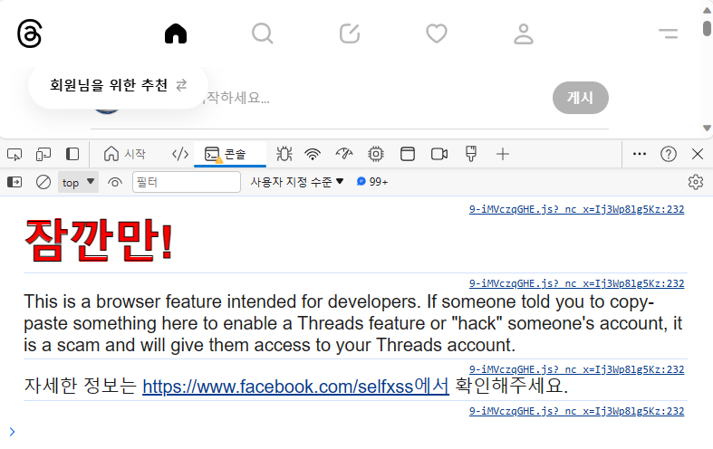
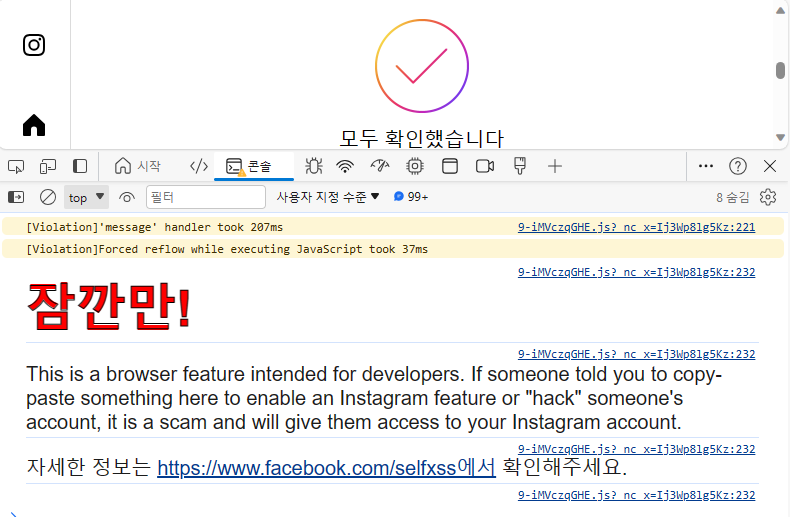

# console.log에서 CSS 사용 방법

디버깅을 하기 위해 console 객체의 log, info, error, dir, table 등 다양한 메서드를 활용하곤 합니다.

텍스트와 객체 이외에도 CSS를 사용할 수 있는데요. 오늘은 console.log에서 CSS 사용 방법을 알아보겠습니다!

## 활용 사례: Self-XSS 주의
대중적으로 사용하는 서비스에서 활용 사례를 찾아보면 Self-XSS에 대한 주의를 주고 있습니다.

Meta에서 운영 중인 Instagram, Threads, Facebook에서는 아래와 같이 Self-XSS에 대한 주의를 주고 있습니다.





Google 번역기에서는 다음과 같이 주의를 주고 있습니다.


(Self-XSS에 대해서는 다음에 다루도록 하겠습니다!)

## CSS 사용 방법
%c를 사용해서 CSS 스타일을 적용할 수 있습니다.
(개발자 도구를 열어서 한번 해보세요!)

```js
console.log(
  '%cHello World',
  'color: red'
)
```


CSS 적용 후에는 새로운 %c 만나거나 공백을 사용해도 해제되지 않기 때문에
CSS 적용을 해제하려면 빈문자를 사용합니다.

```js
console.log(
  '%cHello World%c Noop!',
  'color: red',
  '' // CSS 해제
)
```


## 지원하는 CSS 범위
console.log에서 사용할 수 있는 CSS는 제한되었습니다.
아래와 같은 CSS을 사용할 수 있고, background를 활용하면 SVG와 이미지를 사용할 수 있습니다.

- background / color / font
- border / border-radius / margin / outline / padding
- box-shadow / box-decoration-break
- display / clear / float
- cursor / writing-mode
- line-height / text-*
- white-space / word-spacing / word-break


이상으로 console.log에서 CSS 사용 방법을 알아봤습니다.
감사합니다.