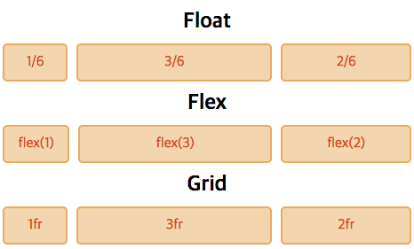

# CSS 레이아웃 비교 - Float vs Flex vs Grid
레이아웃을 코딩하는 방법은 다양한 방법이 있습니다. Float, Flex, Grid 순서로 레이아웃을 배치하는 방법이 발전되었습니다.
각 기술들의 차이와 가장 최근에 만들어진 Grid를 사용하면 어떤 장점이 있는지 정리했습니다.

## 그리드 시스템 구현
6 Grid를 1:3:2로 나누고 각각 같은 여백을 가질 때 코드를 비교해보겠습니다.



### Float
Float로 개발할 때는 가로 사이즈를 직접 계산해서 작성해야 됐고, `overflow: hidden`과 같은 특별한 방법을 사용해서 코딩을 해야 됐습니다.

```html
<div class="box">
  <div class="item">1/6</div>
  <div class="item">3/6</div>
  <div class="item">2/6</div>
</div>
```
```css
.box {overflow: hidden}
.item {float: left}
.item:nth-of-type(1) {
  width: calc((100% - 20px) * 1 / 6)
}
.item:nth-of-type(2) {
  width: calc((100% - 20px) * 3 / 6);
  margin: 0 10px
}
.item:nth-of-type(3) {
  width: calc((100% - 20px) * 2 / 6)
}
```

### Flex
Flex가 도입이 되면서 좀 더 추상적으로 기입이 가능했습니다.  자식 엘리먼트에 1:3:2 비율을 기입하면 레이아웃을 지정 가능합니다.

```html
<div class="box">
  <div class="item">flex(1)</div>
  <div class="item">flex(3)</div>
  <div class="item">flex(2)</div>
</div>
```
```css
.box {display: flex;}
.item:nth-of-type(1) {flex: 1}
.item:nth-of-type(2) {
  flex: 3;
  margin: 0 10px
}
.item:nth-of-type(3) {flex: 2}
```

### Grid
Grid는 Flex처럼 추상적으로 비율을 작성 가능하고, Flex와 다르게 부모 쪽에서 작성 가능합니다. 자식들의 레이아웃을 부모에서 조작이 가능하므로 레이아웃 코딩은 한 부분에서 수정이 가능합니다.

```html
<div class="box">
  <div>1fr</div>
  <div>3fr</div>
  <div>2fr</div>
</div>
```
```css
.box {
  display: grid;
  grid-template-columns: 1fr 3fr 2fr;
  grid-gap: 10px
}
```

