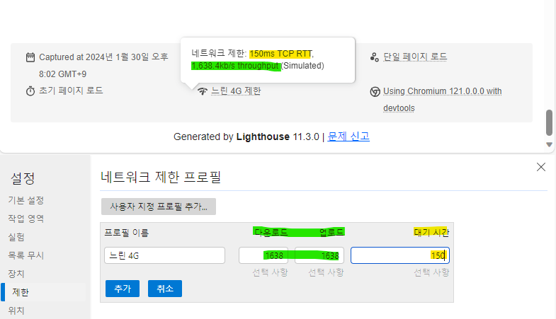

# {Lighthouse Deep Dive} 모바일 장치 이해 (ft. 성능 탭의 측정 결과와 다른 이유)
저는 주로 웹 페이지의 성능을 측정할 때 Lighthouse를 사용합니다.
Lighthouse는 웹 페이지 품질 개선 도구로 Google Chrome에서 공개한 오픈소스이고,
Chrome 개발자 도구에서 쉽게 사용할 수 있습니다.

Lighthouse에서는 모바일 장치를 선택할 수 있는 데요.
모바일 장치를 선택해서 성능을 측정하면 화면 크기 뿐만 아니라 CPU, 네트워크 성능도 조정되는 것을 알고 계셨나요?

이번에는 Lighthouse에서 모바일 장치를 데스크톱과 비교해서
Lighthouse 모바일 장치 이해에 대해서 알아보겠습니다.

목차
- 1. 장치 화면
- 2. 장치 성능
- 부록) 성능 탭의 측정 결과와 다른 이유

## 1. 장치 화면

Lighthouse는 모바일 화면과 데스크톱 화면을 각자 다른 방식으로 표시합니다.

모바일 화면은 장치 애뮬레이션으로 조절해서 보여집니다. 그래서 브라우저 사이즈를 아무리 조절해도 모바일 화면은 변경되지 않고 항상 같은 화면으로 보여집니다.

데스크톱 화면은 현재 보여지고 있는 화면을 기준으로 보여집니다. 그래서 브라우저 사이즈를 조절하면 데스크톱 화면도 변경됩니다.

## 2. 장치 성능

Lighthouse는 모바일과 데스크톱의 성능인 CPU와 네트워크 성능을 다르게 설정합니다.

모바일의 경우는 CPU는 4배 저하시키고, 네트워크 지연 시간을 늘리고, 네트워크 통신 속도를 느리게 합니다.
정확히는 지연 시간은 150ms, 다운로드 속도는 1.6Mbps, 업로드 속도는 750Kbps로 고정 값으로 조절합니다.

데스크톱은 측정하는 PC의 성능을 그대로 사용합니다. 그래서 고사양 컴퓨터일 수록 웹 페이지의 성능은 좋게 측정됩니다.

## 부록) 성능 탭의 측정 결과와 다른 이유
Lighthouse의 모바일 장치는 CPU와 네트워크를 저하 시킨 뒤 성능을 측정하기 때문에 성능 탭의 측정 결과와 다를 수 있습니다.

성능 탭에서 CPU, 네트워크 성능을 조절하면 Lighthouse에서 측정한 결과와 유사한 결과를 얻을 수 있습니다.

### CPU 성능 조절

성능 탭에서 톱니바퀴를 클릭하면 성능 조절 패널이 노출되며, CPU는 선택 박스로 바로 조절할 수 있습니다.

### 네트워크 성능 조절

네트워크는 추가 버튼을 클릭해서 Lighthouse의 모바일 성능과 같은 성능으로 설정 후 사용합니다.

이상으로 Lighthouse 모바일 장치 이해에 대해서 알아봤습니다.
감사합니다.