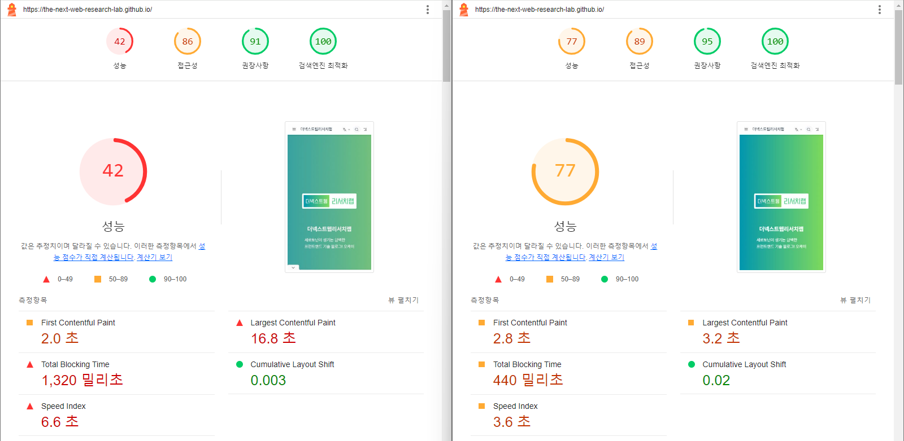
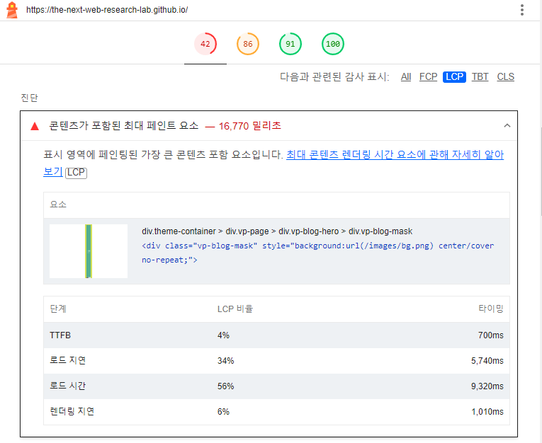
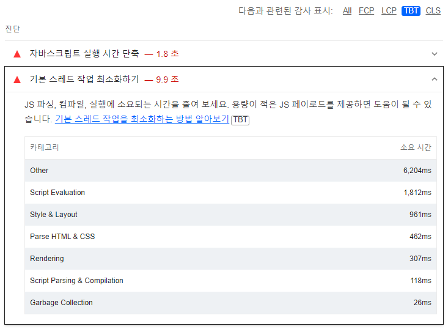

# {Lighthouse Deep Dive} 성능 최적화 과정 (ft. LCP, TBT 최적화)
우연히 블로그의 성능을 라이트하우스로 측정해 봤는데, 성능 점수가 40점대로 나쁜 성능으로 측정돼서 성능 최적화를 하기로 마음을 먹었다. 🫡

우선 성능 최적화 결과부터 보여주고 문제점을 찾는 방법과 해결 과정을 설명하겠다.

목차
- 📄성능 최적화 결과
- 🖼️LCP 최적화
- 💻TBT 최적화

## 📄성능 최적화 결과

라이트하우스에서 모바일 장치로 측정 후 성능 최적화한 결과다.

Largest Contentful Paint(이하 LCP)와 Total Blocking Time(이하 TBT)이 매우 안 좋게 나왔다.

웹 페이지의 성능 개선 포인트는 (1)리소스와 (2)메인 스레드로 크게 두 가지 있다.
리소스 개선은 메인 스레드 개선보다 간단하고, LCP는 리소스 개선에 영향을 많이 받아 LCP부터 먼저 시작한다.

### 🤔Speed Index는?
Speed Index는 First Contentful Paint부터 Cumulative Layout Shift까지 4가지 항목을 개선하면 자연스럽게 개선된다. 그래서 여기서는 Speed Index는 개선하지 않는다. 추후에 성능 최적화할 때 맨 마지막에 개선할 것을 권장한다.

## 🖼️LCP 최적화
우선 LCP(Largest Contentful Paint)는 웹 페이지에서 가장 큰 이미지 또는 텍스트 영역을 의미한다.

### 🔎문제점 찾는 방법

라이트하우스 리포트의 진단 영역에서 LCP 탭을 선택하면 어떤 부분을 개선해야 하는지 알려준다.
첫 번째 항목을 보면 배경 이미지 영향으로 LCP가 안 좋다는 것을 알 수 있다.

배경 이미지는 그라데이션 배경 때문에 사용했는 데, 이미지 로드와 렌더링에 지연이 있으므로 이 부분은 CSS를 사용한 그라데이션으로 변경하면 개선될 것으로 보인다.

### 🪄문제점 해결

위와 같이 배경에 CSS를 사용해서 그리도록 바꿨다.

결과적으로 LCP는 12.9초 감소되었고, 기존에 잘못 적용된 그라데이션 UI 버그도 해결되었다.

이 다음에는 메인 스레드와 연관 있는 TBT 항목을 개선하겠다.
First Contentful Paint(이하 FCP) 항목은 메인 스레드를 최적화하면 자연스럽게 개선되기도 하므로 TBT보단 FCP 먼저 진행한다.

## 💻TBT 최적화
TBT(Total Blocking Time)는 메인 스레드 차단 시간의 총합을 의미한다.
첫 번째 콘텐츠 렌더링과 상호작용 시작 시점의 사이에 있는 메인 스레드 차단 작업들을 계산에 포함한다.

### 🔎문제점 찾는 방법

두 번째 진단을 보면 Other 항목이 비정상적으로 오래 걸리는 것을 확인할 수 있다.
이 부분은 자바스크립트 파일 요청 관련 문제가 있다고 생각했고 성능 탭을 통해서 디버깅을 했다.

성능 탭에서 확인해 보니 "HTML 구문 분석"이 비정상적으로 오래 걸렸다. "HTML 구문 분석"을 자세히 확인해 보니 모든 페이지의 자바스크립트 파일을 `<link rel="prefetch">`로 요청하고 있었다.

블로그의 페이지 수는 300건 이상 있어 그만큼 많은 자바스크립트 파일을 미리 요청하고 있었다.
prefetch는 요청이 많아지면 오히려 성능에 악영향을 미치므로 개선이 필요했다.

### 🪄문제점 해결

빌드 설정에서 prefetch를 제거하도록 설정했다. 초기 로딩이 빠른 것이 좀 더 중요하기 때문에 prefetch는 우선 제거하도록 했다.

prefetch 제거 후 미리 요청하는 자바스크립트를 제거할 수 있었고, "HTML 구문 분석"는 메인 스레드를 차단하지 않는 작업이 되었다.

결과적으로 TBT는 안정적인 상태로 돌아왔고, TBT 개선 과정에서 FCP가 개선되었다.👏

이상으로 Lighthouse를 사용한 성능 최적화 과정을 알아봤다. 
생각보다 간단한 작업으로 웹 페이지를 개선하는 경우가 많으므로 경험이 없다면 시도해 보길 바란다.👍