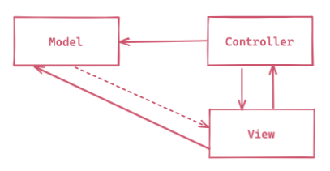
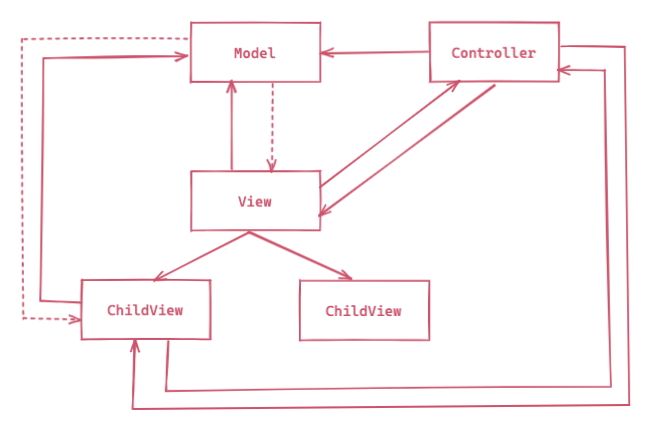
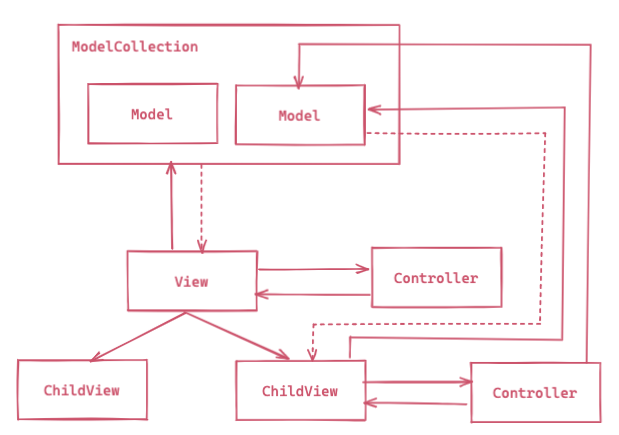

## MVC란
> 참고자료: [Maria - The MVC Framework for JavaScript Application](http://peter.michaux.ca/maria/quick-start-tutorial-for-the-impatient.html)
>


전통적인 MVC는 아래 3가지의 패턴으로 이뤄진다.
1. Model-View: [Observer Pattern](https://chodragon9.github.io/design-patterns/src/gof/behavioral/#%EA%B0%90%EC%8B%9C%EC%9E%90-observer)
1. View-Controller: [Strategy Pattern](https://chodragon9.github.io/design-patterns/src/gof/behavioral/#%EC%A0%84%EB%9E%B5-strategy)
1. View-Views: [Composite Pattern](https://chodragon9.github.io/design-patterns/src/gof/structural/#%EC%BB%B4%ED%8F%AC%EC%A7%80%ED%8A%B8-composite)

```js
const model = new Model();
const view = new View(model);
const controller = new Controller(model, view);

view.setController(controller);

document.body.appendChild(view.build());
```

### View 확장



```js
class View {
  build () {
    const div = document.createElement('div');
    const items = this.model.getState();
    
    items.forEach((item) => {
      const childView = new ChildView(this.model);
      childView.setController(this.controller);
      div.appendChild(childView.build());
    });

    return div;
  }
}
```

### Model 확장



```js
const modelCollection = new ModelCollection();
const model1 = new Model();
const model2 = new Model();

modelCollection.add(model1);
modelCollection.add(model2);

const view = new View(modelCollection);
```

```js
class View {
  build () {
    const div = document.createElement('div');
    const models = this.model.getModels();
    
    models.forEach((model) => {
      const childView = new ChildView(model);
      const childController = new ChildController(model, childView);

      childView.setController(childController);

      div.appendChild(childView.build());
    });

    return div;
  }
}
```
