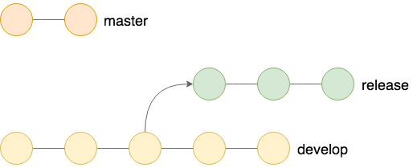
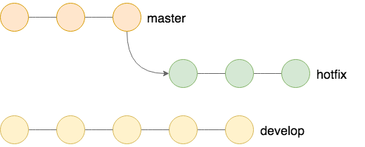
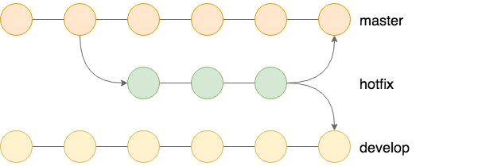
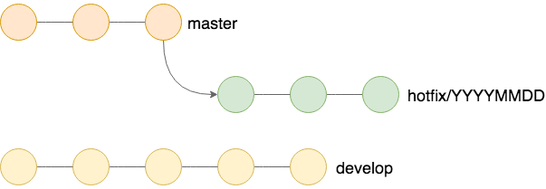
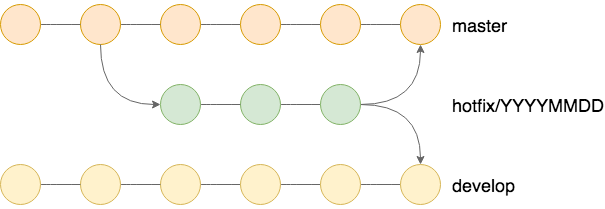

# 형상관리 전략정리

> 이 글을 읽기 위해 <a href="https://git-scm.com/book/ko/v1/Git%EC%9D%98-%EA%B8%B0%EC%B4%88" target="_blank">Git의 기초</a>와 <a href="https://git-scm.com/book/ko/v1/Git-%EB%B8%8C%EB%9E%9C%EC%B9%98" target="_blank">Git 브랜치</a> 사전지식이 필요합니다.

### 글의 목적
프로젝트를 참여하며 코딩역량만큼 도움이 됐던 역량은 형상관리 역량이다. 서비스를 운영하면 형상관리에 대한 다양한 난관을 부딪친다. 이때 개인의 역량에 따라 커밋 단위·충돌 대응·브랜치 전략에서 차이를 보인다. 각 작업은 명확한 기준이 있으면 고민할 시간을 단축할 수 있다.

현업에서 형상관리 도구는 깃(Git)을 많이 사용했다. 깃 사용에 미숙한 협업자에 따라 형상관리 가이드가 필요하다. 최근에도 협업자가 증가해서 형상관리 가이드가 필요했다. 이 기회에 기억 속에 파편화돼있는 형상관리 전략에 대해 정리하고자 작성한 포스트이다.

### 목차
- 작은 단위로 작업 이력 관리
  - 작은 단위로 작업 이력을 남기는 방법
  - 작은 단위로 하지 않을 때 사례
- 작은 단위로 브랜치 관리
  - 기능의 볼륨이 클 때 사례
  - 많은 기능을 혼자 개발 할 때 사례
- 깃 플로우 기반으로 브랜치 관리
  - Feature 브랜치에서 기능 개발
  - Release 브랜치에서 배포 개발
  - Hotfix 브랜치에서 긴급 수정
- 예외 상황일 때 대응 사례
  - 병합 중에 충돌 발생한 사례
  - Pull Request 중인 브랜치에 작업한 사례
  - 예정된 배포 일정 앞에 기능 배포한 사례
- 맺음말

### 작은 단위로 작업 이력 관리
작업 이력을 남기는 방법은 최대한 작은 단위로 하는 것이 작업에 쉬웠다. 작업하기 쉬운 방향의 커밋 방법을 설명하고 근거가 되는 사례를 설명한다.

#### 작은 단위로 작업 이력을 남기는 방법
작업하기 쉬운 방법은 작은 기능 단위로 커밋하는 것이다. 작은 기능 단위는 사용자 스토리로 정의해서 이력을 남기고 있다. 사용자 스토리란 기획서를 기준으로 사용자 관점에서 작성한 기능 단위다.

##### 사용자 스토리 예시
```
- 좋아요 버튼을 클릭하면, 공감수가 1개 증가한다.
- 댓글 버튼을 클릭하면, 댓글을 볼 수 있다.
- 공유하기 버튼을 클릭하면, 공유하기 팝업이 열린다.
```

이렇게 잘게 나뉜 사용자 스토리는 경험상 코드 수정량도 많지 않았다. 작성된 각 사용자 스토리가 하나의 커밋 단위가 되고, 커밋 메시지가 된다.

이렇게 했을 때 장점은 두 가지가 있다. 첫 번째는 기능에 문제가 발생했을 때, 특정 커밋을 되돌리거나 특정 커밋만 가져오고 싶을 때 쉽다. 두 번째는 특정 기능의 이력을 파악하기 쉽다.

#### 작은 단위로 하지 않을 때 사례
의미를 파악하기 힘든 커밋하는 것을 종종 보기도 한다. 의미를 파악하기 힘든 커밋은 커밋을 되돌리거나 특정 커밋만 가져오고 싶을 때 시간이 많이 들고 실수할 확률이 높았다.

경험상 대표적으로 두 가지 사례가 있었다. 

첫 번째는 한 작업의 커밋에 다른 작업을 포함해서 커밋하는 것이다. 코드의 양이 많지 않아 작업이 다른 커밋에 포함해서 커밋을 하는 경우이다. 이 경우는 해당 커밋을 삭제하고 싶을 때 다른 기능에 영향을 미친다.

두 번째는 사용자 스토리를 무수히 많이 작업한 뒤 커밋을 하나만 하는 것이다. 한 이력에 커밋을 했을 때 특정 기능의 이력을 찾기 힘들다. 특정 코드의 작업 이력을 통해 "왜 이렇게 작성했는지"가 필요할 때가 있다. 그때 작업 이력을 보기도 하는데 한 이력에 커밋이 있으면 코드와 작업 이력으로 분석이 안 되었던 경험이 있다.

### 작은 단위로 브랜치 관리
브랜치 관리는 작은 단위일수록 개발할 때 쉬웠다. 경험상 기능의 볼륨이 클 때와 많은 기능을 혼자 개발할 때가 빈번하게 발생하여 두 가지에 대한 사례를 설명한다.

#### 기능의 볼륨이 클 때 사례
이 상황은 feature 브랜치로 나눴을 때 코드 수정사항이 많을 것으로 예상하는 상황이 있다.
- 특정 기능을 개발하는 데 파일 수정 사항이 많을 때
- 기능의 요구사항이 연관된 페이지가 많아 다수의 페이지에서 설정과 사용하는 동작일 때
- develop 브랜치 머지를 장기간 하지 못하고 feature 브랜치에만 개발해야 되는 상황일 때

이런 상황일 때 feature 브랜치가 하나로 개발하면 코드리뷰나 develop에 병합할 때 힘들어진다. 이런 상황에도 기능을 쪼개서 feature 브랜치를 다수 만드는 것을 권하고 싶다.

기능을 쪼개는 단위는 페이지나 부문으로 나누면 경험상 대부분 해결됐다. 이렇게 브랜치를 나누면 해당 기능 개발에 집중할 수 있고, PR 시 코드분량의 따른 부담을 줄일 수 있다.

##### 그림. 작은 기능을 나눠만든 feature 브랜치 예시


#### 많은 기능을 혼자 개발 할 때 사례
이 상황은 확실히 분리 가능한 기능들을 혼자서 개발해야 할 때다. 혼자 작업을 하더라도 feature 브랜치를 나누는 것이 업무의 효율을 높일 수 있다. 특정 기능이 스펙아웃되거나 다수의 기능 중 일부만 배포해야 되는 상황이 존재한다.

브랜치가 하나일 경우 특정 기능을 제거하기 위한 많은 시간과 위험성을 가지게 된다. 다수의 브랜치로 작업을 하게 되면 병합 전에는 유연하게 대응 가능하므로 브랜치를 나눠 작업하는 것을 권하고 싶다.

##### 그림. 기능을 나눠만든 feature 브랜치 예시


### 깃 플로우 기반으로 브랜치 관리
깃 플로우와 브랜치 작명에 대한 경험적인 내용을 다루는 부분이다. 깃 플로우에 대한 경험이 많다면 이 부분은 넘어가도 된다.

#### Feature 브랜치에서 기능 개발
기능 개발은 feature 브랜치에서 작업한다. feature 브랜치는 develop 브랜치로부터 만든다.

##### 그림. feature 브랜치 만들기 예시
<br>

네이밍은 `feature/<기능명>`,`feature/<이슈 아이디>`와 같이 했다.

기능명을 작명할 때 동사·명사 사용 제한을 두지 않고 있다. 이슈 아이디는 업무관리 시스템에서 발급되는 티켓명 또는 이슈 아이디를 사용한다.

##### feature 브랜치 작명 예시
```
[결제페이지] => feature/payment-page
[게시판 글쓰기] => feature/write-board
[버튼 미동작 이슈] => feature/fix-non-operation-button
```
개발완료되면 feature 브랜치에서 develop 브랜치로 병합한다.

##### 그림. feature 브랜치 병합 예시


#### Release 브랜치에서 배포 개발
배포 시기에는 release 브랜치에서 작업한다. release 브랜치는 develop 브랜치로부터 만든다.

##### 그림. release 브랜치 만들기 예시
<br>

release 브랜치는 feature 브랜치와 다르게 확실한 작명 정책이 필요했다. 개발기간에 수정된 내용을 배포하는 것이므로 `release/YYYYMMDD`, `release/<version>`, `release/<스프린트명>`을 사용했다.

release 브랜치에서 QA를 진행 완료 후 배포를 하게 된다. 완료 후에 release 브랜치는 master와 develop 브랜치에 병합되며 배포 태그를 생성한다. 그리고 master 브랜치를 기준으로 서비스 배포를 진행하면 배포가 완료된다.

##### 그림. release 브랜치 병합 예시
<br>

#### Hotfix 브랜치에서 긴급 수정
핫픽스는 배포한 소프트웨어가 비즈니스적으로 문제가 발생했을 때 즉각 대응하는 방안이다. 큰 이슈가 아닌 이상 핫픽스를 하지 않는 것을 추천하며, 마이너한 버그는 다음 배포 시기에 포함하는 게 안정적인 서비스 운영에 도움이 된다.

hotfix 브랜치는 master 브랜치로부터 만든다. 네이밍은 `hotfix/fix-<기능명>`으로 작명했다.

##### 그림. hotfix 브랜치 만들기 예시
<br>

기능 수정이 완료되면 hotfix 브랜치는 develop과 master 브랜치에 병합되고 핫픽스 태그를 생성한다.

##### 그림. hotfix 브랜치 병합 예시


### 예외 상황일 때 대응 사례
소프트웨어는 이해관계자가 다수 연결되어 항상 아름다운 방향으로만 흐르지 않는다. 흔히 발생하는 형상관리 이슈는 feature 브랜치를 작업할 때 빈번하게 발생한다. feature 브랜치 전략에 대한 경험적인 내용과 급히 기능 추가에 대한 경험을 작성한 부분이다.

#### 병합 중에 충돌 발생한 사례
충돌은 feature 브랜치를 develop 브랜치에 병합을 할 때 발생할 확률이 높다. 충돌이 발생하면 develop 브랜치를 feature 브랜치에 병합한다.
병합 시에는 발생한 충돌 사항들 중 동료와 연관있는 기능이라면 꼭 페어 체크를 해야 한다.

##### 그림. develop 브랜치를 feature 브랜치에 병합 예시
<br>

충돌을 수정완료 한 뒤에는 다시 feature 브랜치를 develop 브랜치에 병합하면 완료된다.

##### 그림. feature 브랜치를 develop 브랜치에 병합 예시


#### Pull Request 중인 브랜치에 작업한 사례
이 상황은 실수로 PR(Pull Request) 중인 브랜치로 작업을 하는 경우이다. 이때 PR 중인 브랜치를 기준으로 브랜치를 생성하는 선택을 하면 안 된다. PR이 완료되어 브랜치를 삭제하면 연관된 브랜치도 삭제되기 때문이다.

이 경우를 해결하기 위해서는 먼저 feature 브랜치를 develop 브랜치로부터 만든다. 그리고 생성한 feature 브랜치에 필요한 내용만 `cherry-pick`하여 가져가면 해결된다.

##### 그림. cherry-pick 예시


#### 예정된 배포 일정 앞에 기능 배포한 사례
이 상황은 신규 기능 개발은 급하게 필요하지만, develop에 반영되어있던 기능들이 production에 배포하면 안 되는 사항이 있을 때다.

이 상황은 hotfix 전략으로 해결할 수 있다. 먼저 `hotfix/YYYYMMDD`로 hotfix+develop 역할의 핫픽스 개발 브랜치를 생성한다. hotfix 처럼 개발완료 시 master/develop에 병합되고, develop 처럼 feature를 만들어 병합할 수 있는 역할의 브랜치이다. 

##### 그림. hotfix+develop 역할 브랜치 만들기 예시
<br>

그리고 `hotfix/YYYYMMDD`를 기준으로 기능별로 브랜치를 만들어서 작업한다. 해당 브랜치도 핫픽스의 의미를 내포하여 hotfix라는 접두사를 붙여 작명을 한다.

##### 그림. hotfix 브랜치 만들기 예시
<br>

각 기능의 PR은 `hotfix/YYYYMMDD`에 진행을 한다. 개발 완료 후 내부 테스트가 필요하면 Sandbox에 배포 시 `hotfix/YYYYMMDD`로 배포를 한다. 

##### 그림. hotfix 브랜치를 hotfix/YYYYMMDD 브랜치에 병합 예시
<br>

테스트 완료 후 master/develop에 머지를 진행한다. production 배포는 기존 프로세스와 같이 master로 진행한다. 이렇게 되면 깃플로우 정책을 해치지 않고 작업이 가능하다.

##### 그림. hotfix/YYYYMMDD를 master와 develop 브랜치에 병합 예시


##### 고민이 되었던 부분
이 솔루션을 알기 전까지는 배포하는 부분에서 고민했다. develop/master를 통해서만 배포를 해야 한다는 생각을 가졌는데,
이러한 상황에서는 유연하게 hotfix와 master로 배포하는 것으로 정리하면 유연하게 대응 가능하다고 판단했다.

### 맺음말
제한된 일정에 요구사항을 개발하는 것은 힘든 작업이다. 힘든 작업 후에 형상관리에서 문제가 발생하면 시간과 에너지를 많이 소비하게 된다. 되도록 작은 단위로 커밋을 하고 명확한 전략을 따르는 것을 권하고 싶다.
